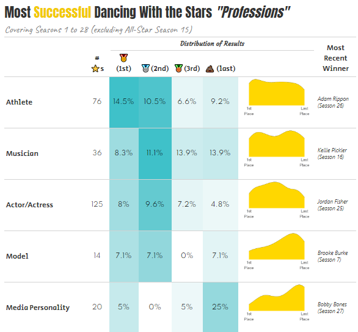
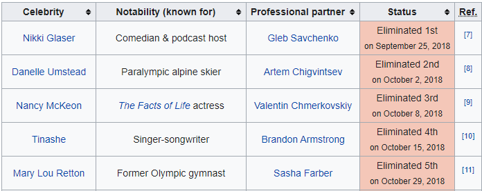

```{r setup, include=FALSE}
knitr::opts_chunk$set(echo = TRUE, warning = FALSE, error = FALSE, message = FALSE)
```

# Motivation

During this pandemic I've found a source of comfort in Dancing with the Stars (DWTS).  I've never watched any other season before and I think a large part of starting now are: 

1. Lack of anything else to watch
2. The rapper Nelly (and the St. Lunatics) have a near and dear place in my heart.

On the R front, I've wanted to mess around with the `gt` package for a while now but hadn't had a great reason to.  However, I had originally wanted to do a post on whether DWTS has "score inflation" throughout the season, but that wound up being more complicated than I would have liked.  So instead why not answer **what is the most successful type of star on Dancing with the Stars**.

And on the `gt` front a huge shout-out to [Kaustav Sen](https://rpubs.com/kaustav/table_contest_2020) whose post on `gt` for the Great American Beer Festival served as a large design inspiration for this post.

# The Final Output

At the end of this post, the final output for the table will look like:



# The Pre-Processing

## Load the Libraries

The main focus of this post is on the `gt` package to make the table, however, other packages are used to get and work with the data.

```{r load_libraries}
library(rvest) #Web Scrape Wikipedia
library(tidyverse) #Data Manipulation / Plots
library(lubridate) #Date Manipulation
library(gt) #Making Fancy Tables / The Focus of This Post
library(glue) #Text Manipulation
```

## Getting all the DWTS Contestants

In order to find the most successful star type, we need to get a list of all the contestants.  Fortunately, Wikipedia has a page for every season and on those pages has a list of information about the contestants including, their name, what their known for, and their status from the season.



Since there are 28 completed Dancing with the Stars seasons this seems like a job for a function to iterate through each season's Wikipedia page to extract that table.  One note is that Season 15 was an all-star season so it will be excluded from this analysis  Unfortunately, the contestant table isn't always in the same place on the page, so the function will need to be a little flexible.

```{r define_scrape_function}
dwts_constants <- function(season_number, tbl_number){
  read_html(glue('https://en.wikipedia.org/wiki/Dancing_with_the_Stars_(American_season_{season_number})')) %>% 
    html_nodes('table') %>% 
    .[[tbl_number]] %>%
    html_table() %>% 
    mutate(season = season_number) %>% 
    janitor::clean_names()
}

```

Given a season number, and the number table on the page to extract the above function will extract and lightly clean the data.  The following code will append all of the contestants on top of each other.

```{r scape_data, cache=TRUE}
contestants <- dwts_constants(1, 2) %>% 
  bind_rows(dwts_constants(2, 3) ) %>% 
  bind_rows(dwts_constants(3, 3) ) %>% 
  bind_rows(dwts_constants(4, 3) ) %>% 
  bind_rows(dwts_constants(5, 2) ) %>% 
  bind_rows(dwts_constants(6, 2) ) %>% 
  bind_rows(dwts_constants(7, 2) ) %>% 
  bind_rows(dwts_constants(8, 2) ) %>% 
  bind_rows(dwts_constants(9, 2) ) %>% 
  bind_rows(dwts_constants(10, 2)) %>% 
  bind_rows(dwts_constants(11, 2)) %>% 
  bind_rows(dwts_constants(12, 2)) %>% 
  bind_rows(dwts_constants(13, 2)) %>% 
  bind_rows(dwts_constants(14, 3)) %>% 
  #bind_rows(dwts_constants(15, 2)) %>%  #Season 15 is an All-Star Season
  bind_rows(dwts_constants(16, 2)) %>% 
  bind_rows(dwts_constants(17, 2)) %>% 
  bind_rows(dwts_constants(18, 2)) %>% 
  bind_rows(dwts_constants(19, 2)) %>% 
  bind_rows(dwts_constants(20, 2)) %>% 
  bind_rows(dwts_constants(21, 2)) %>% 
  bind_rows(dwts_constants(22, 2)) %>% 
  bind_rows(dwts_constants(23, 2)) %>% 
  bind_rows(dwts_constants(24, 2)) %>% 
  bind_rows(dwts_constants(25, 2)) %>% 
  bind_rows(dwts_constants(26, 2)) %>% 
  bind_rows(dwts_constants(27, 2)) %>% 
  bind_rows(dwts_constants(28, 2))
```

Directly from this function the raw data looks like:
```{r raw_data, echo=FALSE}
contestants %>% 
  head(3) %>% 
  knitr::kable()

```

### Cleaning the data

Looking at the raw data there is a lot of data cleaning to be done:

1. The contestant's result shows up in two different columns (`result`, `status`)
2. The `result` field has both placing information as well as dates for when they were either eliminated or won.  For example Eliminated 1st needs to be turned into placed last (depending on how many contestants there were that season)
3. The data contains contestants who withdrew so their place had nothing to do with their "Profession"
4. The `result` field can be cleaned up to be standardized
5. The `notability` field needs to be standardized

All of these steps are handled in the following code:

```{r cleaned_data}
contestant_clean <- contestants %>%
  mutate(
    #Compress Fields That Have Different Names Per Season
    result = coalesce(result, status),
    #Get the dates when Eliminations / Wins Happen
    status_date = mdy(str_extract(result, "\\w+ \\d+, \\d{4}")),
    #Get the Order of Elimination
    eliminated_state = str_extract(result, "Eliminated \\d+") %>% 
      str_remove('Eliminated ') %>%
      as.numeric()
  ) %>% 
  # Remove Contestants that Withdraw
  filter(!str_detect(result, 'Withdrew')) %>% 
  group_by(season) %>% 
  # Add the number of contestants for each season
  mutate(n_contestants = n()) %>% 
  ungroup() %>% 
  #Overwrite Places for 1st/2nd/3rd
  mutate(
    place = case_when(
      str_detect(result, "Winner") ~ 1,
      str_detect(result, "Runner|Second") ~ 2,
      str_detect(result, "Third") ~ 3,
      str_detect(result, "Fourth") ~ 4,
      TRUE ~ n_contestants - eliminated_state + 1
    ),
    # Standardize What Contestants Are "Known For"
    known_for = case_when(
      str_detect(str_to_lower(notability_known_for), 
                 'actor|actress|disney') ~ 'Actor/Actress',
      str_detect(str_to_lower(notability_known_for), 
                 'singer|rapper|band|composer') ~ 'Musician',
      str_detect(str_to_lower(notability_known_for), 
                 'model|miss usa') ~ 'Model',
      str_detect(str_to_lower(notability_known_for),
                 'nhl|nfl|nba|boxer|olympi|diva|tennis|soccer|football|lakers|swim|ufc|nascar|snowboard|wwe|mlb|basketball|rodeo|skier|race car|jockey|dolphins|steelers|packers|lakers|indy 500') ~ 'Athlete',
      str_detect(str_to_lower(notability_known_for), 
                 'journ|anchor|host|caster|personality') ~ 'Media Personality',
      str_detect(str_to_lower(notability_known_for), 
                 'bachelor|star|chef') ~ 'Reality TV Star',
      str_detect(str_to_lower(notability_known_for), 
                 'comedian|magician|entertainer') ~ 'Entertainer',
      str_detect(str_to_lower(notability_known_for), 
                 'owner|co-founder|business|designer') ~ 'Businessperson',
      TRUE ~ "Other"
    )
  ) %>% 
  # Remove Unneeded Columns
  select(-contains('professional'), -ref, -status, -eliminated_state) %>% 
  #Want Scores to be between 0 and 1 where 1 is Last Place and 0 is first place.
  mutate(scaled_place = (place-1)/(n_contestants-1))
```

The `scaled_place` variable will be used to create a standardized density plot by putting each season on a 1 (Last Place) to 0 (1st Place) scale regardless of the number of contestants in the season.  The cleaned data now looks like:

```{r cleaned_data_tbl, echo=FALSE}
contestant_clean %>% 
  head(5) %>%
  knitr::kable()
```

Using Regular Expressions, I've collapsed `r n_distinct(contestants$notability_known_for)` different levels into `r n_distinct(contestant_clean$known_for)` which are:

```{r known_for_types, echo=FALSE}
set.seed(20201025)
contestant_clean %>% 
  group_by(known_for) %>% 
  sample_n(3) %>% 
  summarize(
    Examples = paste(celebrity, collapse = ', ')
  ) %>% 
  knitr::kable(col.names = c('Profession', 'Examples'))

```

# Constructing The Table

## Organizing the Data

For the table, the information we want is for each "Profession":

* How many contestants were there?
* What percentages came in 1st, 2nd, 3rd, and Last?

Some quick `dplyr` magic will allow us to collapse the list of contestants into the structure we want.  We'll also set the order of the table by the descending percentage of first place wins by "profession".

```{r}
contestant_summary <- contestant_clean %>% 
  group_by(known_for) %>% 
  summarize(
    num_stars = n(),
    pct_1st_place = sum(place == 1)/n(),
    pct_2nd_place = sum(place == 2)/n(),
    pct_3rd_place = sum(place == 3)/n(),
    pct_last_place = sum(n_contestants == place) / n()
  ) %>% 
  arrange(-pct_1st_place)

```


## Using {gt} to Build the Table

Now onto actually constructing the table with `gt`.  The [`gt` package](https://gt.rstudio.com/) provides a grammar for tables similar to what `ggplot2` does for charts.  The package provides this visualization to show the different parts of a table:


### Step 1: The basic construction

The most basic construction of a table is done by using the `gt()` function. 

```{r step01}
(g1 <- gt(contestant_summary))
```

When I said *basic*, I meant **basic**.

### Step 2: Adding Titles and Subtitles

The `tab_header()` function allows alterations to the header of the table.  The `title` and `subtitle` arguments create the title and subtitle respectively.  A nice feature of `gt` is the `html()` function will allows the use of HTML and CSS to style these titles.  There is also a `md()` function that allows for markdown rendering.

```{r step02}
(g2 <- g1 %>% 
  tab_header(
    title = html('Most <span style="color:#F2CB05">Successful</span> Dancing With the Stars <i>"Professions"</i>'),
    subtitle = html(
      "<span style = 'color: grey'>Covering Seasons 1 to 28 (excluding All-Star Season 15)</span>"
    )
  ))
```

### Step 3: Adding More Style to the Title

The `tab_style()` function adds various formatting to the table rows and cells.  The style section of the arguments tells `gt` what the style will be and the location argument says where that style should be applied.

The `google_font()` package allows access to all the fonts on the [Google Fonts](https://fonts.google.com/) site.

In this step I'm making the title left-justified, size XX-Large, and using the Anton font.

```{r}
(g3 <- g2 %>% 
  tab_style(
    style = cell_text(
      font = google_font("Anton"), 
      align = "left", 
      size = "xx-large"
    ),
    locations = cells_title("title")
  )
)

```

### Step 4: Add Styling to the Subtitles

Similar to step 3, this step applies formatting to the subtitle

```{r step04}
(g4 <- g3 %>% 
  tab_style(
    style = cell_text(
      font = google_font("Caveat"),
      align = "left", 
      size = "x-large"
    ),
    locations = cells_title("subtitle")
  ) 
)
```

### Step 5: Adding a Spanner Column

A *spanner column* is a column header that is merged across a number of different columns.  It is added with the `tab_spanner()` function:

```{r step05}
(g5 <- g4 %>% 
  tab_spanner(
    label = "Distribution of Results",
    columns = 3:6
  )
)

```

### Step 6: Styling the Spanner

Similar to the title and subtitle, we can use `tab_style()` to apply specific styles to the spanner via the `cells_column_spanners()` function.

```{r step06}
(g6 <- g5 %>% 
  tab_style(
    style = cell_text(
      font = google_font("Courgette"), 
      size = "medium", 
      weight = "bold"
    ),
    locations = cells_column_spanners("Distribution of Results")
  )
)

```

### Step 7: Style the Column Headers and the Profession Column

You can apply the same style to different parts of the table by using a `list()` for the `locations` argument.  Here the style is being applied to all column labels (`cells_column_labels(everything())`) and to the values in the first column (`cells_body(columns = 1)`).

```{r step07}
(g7 <- g6 %>% 
  tab_style(
    style = cell_text(
      font = google_font("Secular One"), 
      size = "large"
    ),
    locations = list(
      cells_column_labels(everything()), 
      cells_body(columns = 1)
    )
  )  
)

```

### Step 8: Styling the cells

Applying a center alignment to the 2nd through 6th columns.

```{r step08}
(g8 <- g7 %>% 
  tab_style(
    style = cell_text(
      font = google_font("Spartan"), 
      size = "medium",
      align = 'center'
    ),
    locations = cells_body(columns = 2:6)
  )
)

```

### Step 9: Turn Cell Decimals to Percentages

There are a number of `fmt_*` functions to handle formatting for values.  The `fmt_percent` function will apply a percent format to all the columns beginning with "pct_".  While this is the first instance of using tidyselect syntax for telling `gt` what columns to use, the package can take names, column numbers, or tidyselect.

```{r step09}
(g9 <- g8 %>% 
  fmt_percent(
    columns = starts_with('pct'),
    decimals = 1,
    drop_trailing_zeros = TRUE
  )
 )

```

### Step 10: Have some fun by turning column headers into emojis

Like other markdown text in R `gt` can also support emojis!  Here we can add in medals for 1st, 2nd, and 3rd.... and a personal favorite emoji to represent last.  Emojis can be added into markdown through the `emo::ji()` function.

```{r step10}
(g10 <- g9 %>% 
  cols_label(
    known_for = "",
    num_stars = paste0("# ",emo::ji('star'), "s"),
    pct_1st_place = paste0(emo::ji("1st_place_medal"), "(1st)"),
    pct_2nd_place = paste0(emo::ji("2nd_place_medal"), "(2nd)"),
    pct_3rd_place = paste0(emo::ji("3rd_place_medal"), "(3rd)"),
    pct_last_place = paste0(emo::ji("poo"), " (last)")
  )
)

```

### Step 11: Add a source and do some formatting

There a couple things going on in this step:

1. I'm adding a source line with `tab_source_note()` and using `md()` to allow me to use markdown style formatting.
2. I'm using `tab_options()` to remove the top border from the table and shrink the gaps between the rows in the table.
3. I'm using `cols_width()` to tell `gt` to make the first column 200px wide

```{r}
(g11 <- g10 %>%
  tab_source_note(md("**Data:** DWTS Wikipedia Articles | **Table Author:** JLaw")) %>%
  tab_options(
    table.border.top.color = "white",
    data_row.padding = px(0),
  ) %>% 
  cols_width(
    1 ~ px(200),
  )
)
```

### Step 12: Adding a Color Scale for the % Columns

The `data_color` function allows for doing conditional formatting based on the values in the columns.  The `columns` argument allows to specific which colors should receive the formatting.  The `colors` argument defines the palette.  And the `apply_to` argument can take the values of "fill" to fill the background or "text" to change the color of the text.

```{r step12}
(g12 <- g11 %>% 
  data_color(
    columns = vars(pct_1st_place, pct_2nd_place, pct_3rd_place, pct_last_place),
    colors = scales::col_numeric(
      palette = c("white", "#3fc1c9"),
      #F2CB05 = Gold COlor
      domain = NULL
    ),
    apply_to = "fill",
  )
 )

```

This looks pretty good... but we can do better!!!

## Turning it up to 11 by adding in Density Plots

In order to add in ggplots into a row in the table we need to:

* Build a function to create the plot for each row of the table
* Use `purrr:map()` to add the plot as a list-column to the table
* Use `gt::text_transform` to insert the image into the table

**NOTE:** Since this required making a new data set much of the `gt` code is repeating the first section but is provided in its entirely for completeness.

### Writing the function to build the chart

For the function I want it to take a "profession" and return a density part using the `scaled_place` variable defined at the top.  The function takes in a profession label and a dataset and returns a density plot.

```{r density_function}
plot_dens <- function(profession, data) {
  
  plot_data <- 
    data %>% 
    filter(known_for == {{ profession }}) 
  
  plot <- 
    plot_data %>% 
    ggplot(aes(x = scaled_place)) +
    geom_density(aes(y = ..scaled..), fill = 'gold') +
    annotate("text", x = 0, y = -.05, 
             label = "1st\nPlace", size = 10, color = "grey40", vjust = 1) +
    annotate("text", x = 1, y = -.05, 
             label = "Last\nPlace", size = 10, color = "grey40", vjust = 1) +
    coord_cartesian(
      xlim = c(-.1, 1.1),
      ylim = c(-.7, NA)
    ) + 
    theme_void()
  
  plot
  
}
```

### Adding the plots into the data set

The main part of this step is using the `map()` function to iterate through the professions and use them as input into the function defined above.  The column `plots` is a list-column containing all the ggplot information.

The left join is because I want to add in a column for the most recent winner in each category.

```{r}
contestant_summary_with_graph <- contestant_summary %>% 
  mutate(plots = purrr::map(contestant_summary$known_for %>% unique, 
                            plot_dens, data = contestant_clean)) %>% 
  left_join(
  ###Add in Recent Winner Images
  contestant_clean %>% 
    filter(place == 1) %>% 
    group_by(known_for) %>% 
    slice_max(season, n = 1) %>% 
    select(celebrity, season, known_for) %>% 
    ungroup() %>% 
    transmute(
      known_for,
      lbl = paste0(celebrity,' (Season ',season,")")
    )
  )
```

### Creating the Final Table

In order to turn the plots into columns the `text_transform()` function is used to take the `plots` column and run a function that calls `ggplot_image` with certain height and aspect ratio parameters on each row in the table.

```{r text-transform, eval=FALSE}
text_transform(
    locations = cells_body(vars(plots)),
    fn = function(x) {
      map(contestant_summary_with_graph$plots, ggplot_image, 
          height = px(120), aspect_ratio = 1.5)
    }
  )
```

Now we can put it all together.  Besides adding in the plots, there's a few steps at formatting the Most Recent Winner cell.  But nothing that hasn't been covered earlier.


```{r final_table}
#Base Table
gt(contestant_summary_with_graph) %>% 
  #Add Titles
  tab_header(
    title = html('Most <span style="color:#F2CB05">Successful</span> Dancing With the Stars <i>"Professions"</i>'),
    subtitle = html(
      "<span style = 'color: grey'>Covering Seasons 1 to 28 (excluding All-Star Season 15)</span>"
    )
  ) %>% 
  #Format Title
  tab_style(
    style = cell_text(
      font = google_font("Anton"), 
      align = "left", 
      size = "xx-large"
    ),
    locations = cells_title("title")
  ) %>% 
  #Format Subtitle
  tab_style(
    style = cell_text(
      font = google_font("Caveat"),
      align = "left", 
      size = "x-large"
    ),
    locations = cells_title("subtitle")
  )  %>% 
  #Adding Spanning Column
  tab_spanner(
    label = "Distribution of Results",
    columns = 3:7
  ) %>% 
  #Style The Spanner Column
  tab_style(
    style = cell_text(
      font = google_font("Courgette"), 
      size = "medium", 
      weight = "bold"
    ),
    locations = cells_column_spanners("Distribution of Results")
  ) %>% 
  #Style the Column Labels and Profession Column
  tab_style(
    style = cell_text(
      font = google_font("Secular One"), 
      size = "large"
    ),
    locations = list(
      cells_column_labels(everything()), 
      cells_body(columns = 1)
    )
  )  %>% 
  #Style the Cells
  tab_style(
    style = cell_text(
      font = google_font("Spartan"), 
      size = "medium",
      align = 'center'
    ),
    locations = cells_body(columns = 2:6)
  ) %>% 
  #Format Cells to %s
  fmt_percent(
    columns = starts_with('pct'),
    decimals = 1,
    drop_trailing_zeros = TRUE
  ) %>% 
  #Turn Headers to Emojis
  cols_label(
    known_for = "",
    num_stars = paste0("# ",emo::ji('star'), "s"),
    pct_1st_place = paste0(emo::ji("1st_place_medal"), "(1st)"),
    pct_2nd_place = paste0(emo::ji("2nd_place_medal"), "(2nd)"),
    pct_3rd_place = paste0(emo::ji("3rd_place_medal"), "(3rd)"),
    pct_last_place = paste0(emo::ji("poo"), " (last)"),
    plots = "",
    lbl = "Most Recent Winner"
  ) %>% 
  ###Add in Source and Doing Some Minor Formatting
  tab_source_note(md("**Data:** DWTS Wikipedia Articles | **Table Author:** JLaw")) %>%
  tab_options(
    table.border.top.color = "white",
    data_row.padding = px(0),
  ) %>% 
  cols_width(
    1 ~ px(200)
  ) %>% 
###Add a Color Scale for 1st Place
  data_color(
    columns = vars(pct_1st_place, pct_2nd_place, pct_3rd_place, pct_last_place),
    colors = scales::col_numeric(
      palette = c("white", "#3fc1c9"),
      #F2CB05 = Gold COlor
      domain = NULL
    ),
    apply_to = "fill",
  ) %>% 
  ######################NEW THINGS START HERE#########################
  # Add In Density Plots (NEW)
  text_transform(
    locations = cells_body(vars(plots)),
    fn = function(x) {
      map(contestant_summary_with_graph$plots, ggplot_image, 
          height = px(120), aspect_ratio = 1.5)
    }
  ) %>% 
  text_transform(
    locations = cells_body(vars(lbl)),
    fn = function(x){
      if_else(!is.na(x), str_replace_all(x, " \\(", "<br> \\("), "")
    }
  ) %>% 
  tab_style(
    style = cell_text(
      style = 'italic',
      size = px(13),
      v_align = 'middle',
      align = 'left'
    ),
    locations = cells_body(columns = vars(lbl))
  ) %>%
  cols_width(
    8 ~ px(100)
  )

```

# So what is the most successful "profession" in DWTS?

Seems pretty clearly to be the athletes as close to 15% of the Athletes have wound up winner.  On the other end of the spectrum, the Reality TV stars and Media Personalities have faired less well... although they have gotten their first wins in the last two seasons.