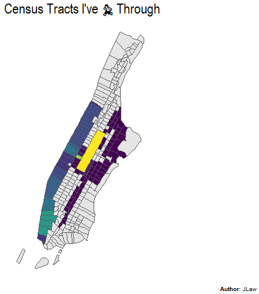

```{r setup, include=FALSE}
knitr::opts_chunk$set(echo = TRUE, warning = FALSE, error = FALSE, message = FALSE)
```



In a [previous post](/2021/04/01/heatmapping-my-new-york-city-marathon-training/) I created a cool-looking (in my opinion) heatmap of my Marathon training from years back.  One of the downsides to that density-based method of making the heat map was that routes I only ran once didn't show up very clearly.  I also wanted to know roughly what % of Manhattan I covered in my runs.  This post will use that same data to create a choropleth map by Census Tract to both visualize all the tracts I passed through in my training as well as determine what % of Manhattan's land area did I cover.

## Libraries Used

The packages used in this analysis are the same from the prior analysis, `Tidyverse` for data manipulation, `sf` for modifying spatial data, `tigris` for getting the basemaps to plot my routes and `extrafont` to bring in new fonts for the plots.

```{r libraries}
library(tidyverse) # Data Manipulation
library(sf) # Manipulation Spatial Data
library(tigris) # Getting Tract and Roads Spatial Data
library(extrafont) # Better Fonts For GGPLOT

```

## Data Used

The data is also the same running route data from the prior post.  For more details on its creation please reference the [prior post](/2021/04/01/heatmapping-my-new-york-city-marathon-training/).


```{r data_file}
runs_and_routes <- readRDS('data/runs_and_routes.RDS')
all_routes <- readRDS('data/all_routes.RDS')
```

For the basemap I'm again using the `tigris` package however this time getting census tracts rather than roads.  According to the package, *Census tracts generally have a population size between 1,200 and 8,000 people, with an optimum size of 4,000 people*.  The map is downloaded using the `tracts()` function with inputs for state and county.

```{r tracts, cache=TRUE, results='hide'}
nyc_tracts <- tracts("NY", "New York", cb = T) %>% 
  st_transform(crs = st_crs(runs_and_routes$geometry))
```

```{r map1}
ggplot() + geom_sf(data = nyc_tracts) + ggthemes::theme_map()
```

Unlike the [prior analysis](/2021/04/01/heatmapping-my-new-york-city-marathon-training/) where the heatmap was just overlaid atop the map, here I need to identify which census tracts contained a route I ran vs. which didn't. This can be done using the `st_join` function, specifying it to be a left join, and specifying the join type as `st_intersects` which joins the route information if the lat/long is contained in the census tract.  The data is then grouped by tract_name and some other tract metadata.  Then I create a field for the number of routes contained in each census tract, which will be used for the choropleth.


```{r joining}
#Join Routes to Tracts by Intersecting
nyc_geo_join <- nyc_tracts %>% 
  st_join(all_routes %>% distinct(route_id, geometry),
          join = st_intersects,
          left = T
          ) %>% 
  group_by(
    TRACTCE, #Census Tract ID
    ALAND, #Land Area
    AWATER #Water Area
  ) %>% 
  summarize(num_routes = n_distinct(route_id, na.rm = T), .groups = 'drop') %>% 
  #Set 0 Routes to NA colored
  mutate(num_routes = if_else(num_routes == 0, NA_integer_, num_routes))

```

## Visualization

The choropleth provides an alternative version to the heatmap which will better show each census tract that **at least one** of my routes had passed through.  Really rare routes did not show up on the heatmap, but they will be clearer here.

```{r cloropleth}
ggplot() + 
  geom_sf(data = nyc_geo_join, 
          aes(fill = num_routes)) + 
  scale_fill_viridis_c(na.value = "grey90", guide = F) + 
  coord_sf(xlim = c(-74.15, -73.8)) + 
  labs(title = paste0("Census Tracts I've ",emo::ji('running')," Through"),
       fill = "# of Routes Run",
       caption = "**Author:** JLaw") + 
  ggthemes::theme_map() + 
  theme(
    plot.title = element_text(size = 18, family = 'Arial Narrow', hjust = .5),
    plot.caption = ggtext::element_markdown(),
    plot.caption.position = 'plot'
  )

```

Now the East Side routes are clearer.

## What % of Manhattan Did I Run Through?

The island of Manhattan covers `r round(sum(nyc_tracts$ALAND) / 2589988, 1)` square miles.  I was curious what % of square miles I covered based on census tracts.  While this will seriously over-count my distance covered it is easy to calculate.  If I ran through the tract I get to count 100% of its land area.  If I did not, I count nothing.  

The `ALAND` columns from the Census Tract data contains the land area in square kilometers [which I convert to square miles](https://www.census.gov/quickfacts/fact/note/US/LND110210). 

```{r summary}
data_summary <- nyc_geo_join %>%
  as_tibble %>% 
  mutate(covered = !is.na(num_routes)) %>% 
  group_by(covered) %>% 
  summarize(tracts = n(),
            #Convert Square KM to Square Miles
            area = sum(ALAND)/2589988) %>%
  mutate(pct_tracts = tracts / sum(tracts),
         pct_area = area/sum(area))

```

During this marathon training, I ran through 101 of Manhattan's 288 Census Tracts (35%) and passed through census tract's covering 8.7 *mi^2* out of 22.7 *mi^2* for **38.4%**.
