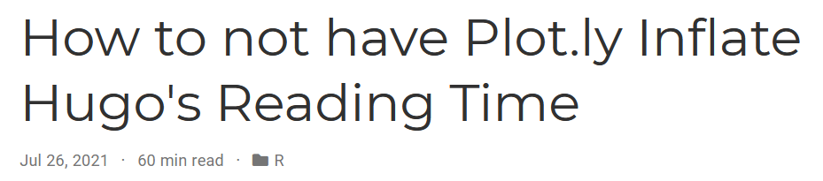

```{r setup, include=FALSE}
knitr::opts_chunk$set(echo = TRUE, warning = FALSE, error = FALSE, message = FALSE, fig.height = 8, fig.width = 12)
```

I'm a big proponent of enabling the reading time option on this blog which uses Hugo's academic theme.  I always appreciate seeing it on other blogs so I know how much time to invest in the post.  I also like it because its a feedback mechanism for me to try to write more concisely.  But having too long a reading time at the beginning of a post can be a deterrent to getting people to read.

Writing the recap post for [this blog's 1 year anniversary](https://jlaw.netlify.app/2021/07/14/celebrating-the-blog-s-first-birthday-with-googleanalyticsr/), when I first generated the post using plot.ly for an interactive chart, I noticed that the reading time ballooned up to 98 minutes from the 13 that it was supposed to be.

Turning to "Dr. Google" I didn't find any immediate solutions for getting the reading time to be more tractable.  However, I did figure out a small "hack" within RMarkdown to provide the same end output to the blog, but without the increase in reading time.


This post will show:

1. That this happens
2. Why this happens
3. And a way to continue to use plot.ly from RMarkdown without having it balloon the post's reading time.

```{r libraries}
library(tidyverse)
library(plotly)
```

## What is Happening?

When rendering a RMarkdown file to Hugo and using a `plot.ly` chart that includes categorical data it will cause the article's reading time to balloon.  At least it will in the case where there are many points with categorical data.  For this trivial example, I'll see which character from Friends had the most lines throughout the run of the show.  Apparently this is available in a `friends` R package... because everything is available in an R package!!


```{r eval=FALSE}
p <- friends::friends %>% 
  filter(!is.na(speaker)) %>% 
  #Creating Running Season and Episode Indicator
  inner_join(
    friends::friends %>% 
      distinct(season, episode) %>%
      arrange(season, episode) %>%
      mutate(episode_num = row_number()),
    by = c('season', 'episode')
  ) %>%
  #Summarize By Character
  count(episode_num, speaker, name = "lines") %>%
  group_by(speaker) %>% 
  arrange(episode_num) %>%
  mutate(total_lines = cumsum(lines),
         max_lines = max(total_lines)) %>%
  ungroup() %>%
  #Keep Top 20
  mutate(rnk = dense_rank(-max_lines)) %>%
  filter(rnk <= 20) %>% 
  ggplot(aes(x = episode_num, y = total_lines, color = speaker)) + 
    geom_line() + 
    labs(x = "Episode # of Friends",
         y = "Number of Lines",
         title = "Cumulative Number of Lines Spoken by Characters on Friends") + 
    cowplot::theme_cowplot() + 
    theme(legend.position='none',
          plot.title = element_text(size = 14)) 

ggplotly(p)
```

```{r render, fig.height=8, fig.width=12, echo=FALSE}
htmltools::tags$iframe(
  src = "p1.html", 
  scrolling = "no", 
  seamless = "seamless",
  frameBorder = "0",
  height=400,
  width=800
)

```

But **WTF**... when I render this page I see that the Reading Time is 57 minutes!!! For this article to this point!! Insanity.



## Why is this happening?

The TL;DR of what's going on is that plot.ly embeds all of the data from the chart directly into the page source.  So if we view the page source we'll see elements for every point of the data:


Then (I believe) Hugo misinterprets aspects of this data as additional word count and that's how an article that should only be a few minutes becomes closer to an hour.

## How to get around this?

In my post, I worked around this by:

1. Displaying the code I wanted to show with an `eval=FALSE` option on the code chunk to not actually render the plot.ly chart but show the code that **WOULD** render it.
2. Having a 2nd code block that's nearly identical with a `echo=FALSE` option on the code chunk to not show the code that is actually run.  This code chunk should **also** save the plot.ly widget as a self-contained file to the directory using something like `htmlwidgets::saveWidget(p1, file="p1.html", selfcontained = T)` when p1 is the  `ggplotly()` element and *p1.html* is output.
3. Have a 3rd code chunk with `echo=FALSE` to create an iframe tag that will contain the HTML file created in step 2.  This is done with `htmltools::tags$iframe(src = "p1.html")` and some other options.


To show this in action (although I'll display all 3 code blocks in this example)

### Code Block 1: The Code You Want To Display

This is a repeat from the code from above which has `eval=FALSE` so its shown but not run:

```{r cb1, eval=FALSE}
p <- friends::friends %>% 
  filter(!is.na(speaker)) %>% 
  #Creating Running Season and Episode Indicator
  inner_join(
    friends::friends %>% 
      distinct(season, episode) %>%
      arrange(season, episode) %>%
      mutate(episode_num = row_number()),
    by = c('season', 'episode')
  ) %>%
  #Summarize By Character
  count(episode_num, speaker, name = "lines") %>%
  group_by(speaker) %>% 
  arrange(episode_num) %>%
  mutate(total_lines = cumsum(lines),
         max_lines = max(total_lines)) %>%
  ungroup() %>%
  #Keep Top 20
  mutate(rnk = dense_rank(-max_lines)) %>%
  filter(rnk <= 20) %>% 
  ggplot(aes(x = episode_num, y = total_lines, color = speaker)) + 
    geom_line() + 
    labs(x = "Episode # of Friends",
         y = "Number of Lines",
         title = "Cumulative Number of Lines Spoken by Characters on Friends") + 
    cowplot::theme_cowplot() + 
    theme(legend.position='none',
          plot.title = element_text(size = 14)) 

ggplotly(p)
```

### Code Block 2: The Code That's ACTUALLY run to save the plot.ly chart to an external file

This would normally have `echo=FALSE` so that it is run but not seen.  It is identical to the prior code block but it will save the chart to *p1.html*.

```{r cb2}
## Identical Code to CB1
p <- friends::friends %>% 
  filter(!is.na(speaker)) %>% 
  #Creating Running Season and Episode Indicator
  inner_join(
    friends::friends %>% 
      distinct(season, episode) %>%
      arrange(season, episode) %>%
      mutate(episode_num = row_number()),
    by = c('season', 'episode')
  ) %>%
  #Summarize By Character
  count(episode_num, speaker, name = "lines") %>%
  group_by(speaker) %>% 
  arrange(episode_num) %>%
  mutate(total_lines = cumsum(lines),
         max_lines = max(total_lines)) %>%
  ungroup() %>%
  #Keep Top 20
  mutate(rnk = dense_rank(-max_lines)) %>%
  filter(rnk <= 20) %>% 
  ggplot(aes(x = episode_num, y = total_lines, color = speaker)) + 
    geom_line() + 
    labs(x = "Episode # of Friends",
         y = "Number of Lines",
         title = "Cumulative Number of Lines Spoken by Characters on Friends") + 
    cowplot::theme_cowplot() + 
    theme(legend.position='none',
          plot.title = element_text(size = 14)) 

################MODIFIED PART STARTS HERE##############################

## Save the plot.ly chart to an object
p1 <- ggplotly(p)

## Save the object as a self-contained HTML file
htmlwidgets::saveWidget(p1, file="p1.html", selfcontained = T)

```

### Code Block 3: The code to redner the stand-alone plot.ly chart

This also would normally have `echo=FALSE` to run the code but not display it.

```{r cb3, fig.height=8, fig.width=12}
htmltools::tags$iframe(
  src = "p1.html", 
  scrolling = "no", 
  seamless = "seamless",
  frameBorder = "0",
  height=400,
  width=800
)

```

And now as you can see, we have the plot.ly chart displayed.  But the reading time is a much more manageable 5 minutes.