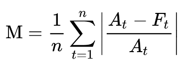

```{r setup, include=FALSE}
knitr::opts_chunk$set(echo = TRUE, warning = FALSE, message = FALSE, error = FALSE)
```


# Introduction

Between January 13th and January 27th, 2021 the stock price for Gamestop ([GME](https://www.google.com/finance/quote/GME:NYSE)) rose 10x from $31 to $374 dollars.  This rise was in part due to increased popularity on the Reddit forum [r/wallstreetbets](https://www.reddit.com/r/wallstreetbets/) looking to create a short squeeze and because they "liked the stock".  This rapid rise also drew attention of popular media such as [CNBC](https://www.cnbc.com/2021/01/26/gamestop-shares-are-jumping-again-but-short-sellers-arent-backing-down.html):


However, this post will not try to understand the mechanics of why GME rose or whether it *should* have risen.  What I will try to answer is **"how unexpected was its rise"** using an array of different forecasting tools.  To assess how expected this rise in GME stock is, I'll be using the following packages:

* Anomalize
* Prophet
* Auto.Arima from Forecast
* CausalImpact

From these methods we should get a good idea of just how unexpected this rise was.  The method for doing this will be using historical price data through January 21st to predict the Gamestop stock price for the period of January 22nd, through February 4th and looking at the mean average percent error (MAPE[^1]) to quantify the amount of unexpectedness.

[^1]: Practically, the MAPE function is being calculated using the `yardstick` package where the format is `yardstick::mape(truth, estimate)` where truth and estimate are the columns for the actual and predicted values.

As a reminder the MAPE is calculated as:
<center>
{width=25%}
</center>

where A is the actual and F is the forecasted value.

## Peer Sets

While I can look at the GME time-series and know that its an outlier relative to past performance maybe something in early January caused **all** video games related stocks to increase.  The peer set that I will look at using as external regressors are:

* Nintendo (NTDOF) - *Maker of the Switch System*
* Sony (SONY) - *Maker of the Playstation System*
* Microsoft (MSFT) - *Maker of the XBox System*

# Data

I'll be using the stock prices for these four stocks from 1/1/2016 through 2/22/2021 for this analysis and I will use the [`tidyquant`](https://business-science.github.io/tidyquant/) package to get this data through the *tq_get()* function.

```{r base_packages}
library(tidyquant) #Get Stock Data 
library(tidyverse) #Data Manipulation
library(lubridate) #Date Manipulation

```


```{r get_stockprices}
### Make Data Weekly
dt <- tq_get(c('GME', 'SONY', 'NTDOF', 'MSFT'),
             get='stock.prices',
             from = '2016-01-01',
             to = '2021-02-22') 


```


With the data pulled we can visualize each of the time-series for the four stocks.  While the peer stocks all rose between 2020 and Feb 2021 it does appear that Gamestop truly "goes to the moon" above and beyond the peer stocks.

```{r plot_stock}
dt %>% 
  filter(ymd(date) >= ymd(20200101)) %>% 
  ggplot(aes(x = date, y=close, color = symbol, group = symbol)) + 
     geom_line() + 
    geom_vline(xintercept = ymd(20210122), lty = 2, color = 'red') + 
    geom_vline(xintercept = ymd(20210204), lty = 2, color = 'red') + 
   labs(x = "Date", y = "Closing Price", title = "Gamestop's Ride to the Moon &#128640;&#128640;&#128640;",
         subtitle = "Fueled by <span style='color:#ff4500'><b>r/wallstreetbets</b></span> $GME rose nearly 10x in a week",
        caption = "<i>Prediction zone bounded by the <span style='color:red'>red dashed</span> lines</i>"
        ) +
     scale_color_discrete(guide = 'none') +
     scale_x_date(date_breaks = "6 months", date_labels = "%b %Y") + 
      facet_wrap(~symbol, ncol = 1, scales = "free_y") + 
      cowplot::theme_cowplot() + 
      theme(
        plot.title = ggtext::element_markdown(),
        plot.subtitle = ggtext::element_markdown(),
        plot.caption = ggtext::element_markdown(),
        strip.background = element_blank(),
        strip.text = ggtext::element_textbox(
          size = 12,
          color = "white", fill = "#5D729D", box.color = "#4A618C",
          halign = 0.5, linetype = 1, r = unit(5, "pt"), width = unit(1, "npc"),
          padding = margin(2, 0, 1, 0), margin = margin(3, 3, 3, 3)
        )
      )

```

# Anomalize

[`anomalize`](https://github.com/business-science/anomalize) is a package developed by [Business Science](https://www.business-science.io/) to enable tidy anomaly detection.  This package has three primarily functions:

1. `time_decompose()` - which separates the data into its components
2. `anomalize()` - which runs anomaly detection on the remainder component
3. `time_recompose()` - recomposes the data to create limits around the "normal" data.

The package also provides two options for calculating the remainders, STL and Twitter.  The STL method does seasonal decomposition through loess while the Twitter method does seasonal decomposition through medians.  Additionally there are two options for calculating the anomalies from the remainders, IQR and GESD.  

As for which methods to choose, a talk from [Catherine Zhou](https://www.youtube.com/watch?v=n9GOvto69aQ&t=6s) summarizes the choice as:

* Twitter + GESD is better for highly seasonal data
* STL + IQR better if seasonality isn't a factor.

More details on these methods are available in the [anomalize methods](https://cran.r-project.org/web/packages/anomalize/vignettes/anomalize_methods.html) vignettes.

Since all of these stocks benefit from increases in holiday sales I'll use **STL + IQR**.  Unfortunately, `anomalize` (to my knowledge) cannot handle covariates, so I'll only be checking for anomalies for the Gamestop stock.  Although I'll add other regressors in the other packages.

```{r anomalize}
library(anomalize)

anomalize_dt <- dt %>%
  filter(symbol == 'GME') %>% 
  # Merge keeps all of the original data in the decomposition
  time_decompose(close, method = 'stl', merge = T, trend = "1 year") %>% 
  anomalize(remainder, method = "iqr") %>% 
  time_recompose() %>% 
  filter(between(date, ymd(20210122), ymd(20210204)))

```
Looking at our prediction window returns:

```{r anaomlize_pred}

predictions_anomalize <- anomalize_dt %>% 
  transmute(date, actual = close, predicted = trend + season, 
            normal_lower = recomposed_l1, normal_upper = recomposed_l2, 
            residual = remainder, anomaly)


knitr::kable(predictions_anomalize, digits = 2)
```
So `anomalize` correctly identified all dates as anomalies vs what was expected.  Now I can calculate the MAPE as `r anomalize_dt %>% summarize(mape = mean(abs(remainder/close))) %>% pull(mape) %>% scales::percent(accuracy = .01)` which means that only 16% of Gamestop's stock movement was predicted.

# Prophet

[`Prophet`](https://facebook.github.io/prophet/) is a forecasting library that was developed by Facebook.  To calculate the MAPE, I will fit the prophet model to the data before the prediction period  and then predict for the data in our prediction period (post).  Prophet does allow for the addition of other regressors so I will run two version of the model.  The first will just be on the Gamestop time series and the second will bring in the Sony, Nintendo, and Microsoft regressors.


## Data Processing

Currently, the data is in a tidy format where all symbols are in a separate row.  In order to use them in prophet (and in future packages), I need to have the data in a format where each row is a date and all of the symbols are separate columns.  Additionally, to be used in prophet the data must have a `ds` column for for the date and a `y` column for the time series being projected.  The following code block will split into the pre-period and the prediction period as well as rename the GME series to `y` and date to `ds`.

```{r split_pre_post}
prep_data <- dt %>% 
  select(date, symbol, close) %>% 
  pivot_wider(names_from = 'symbol', values_from = 'close') %>% 
  rename(y = GME, ds = date)

pre <- prep_data %>% filter(ds <= ymd(20210121))
pred <- prep_data %>% filter(between(ds, ymd(20210122), ymd(20210204)))


```


## Model 1: Only the Gamestop Time Series

```{r prophet_no_regressors}
library(prophet)

#Build the Model
model_no_regressors <- prophet(pre)
#Predict on the Future Data
model_no_regressors_pred <- predict(model_no_regressors, pred)

```
We can look at the predicted results and the residuals by joining the actual data back to the predicted data:

```{r prophet_no_reg_pred}
predictions_prophet_no_reg <- model_no_regressors_pred %>% 
  inner_join(pred %>% select(ds, y), by = "ds") %>% 
  transmute(ds, actual = y, predicted = yhat, lower = yhat_lower, 
            upper = yhat_upper, residual = y-yhat)

knitr::kable(predictions_prophet_no_reg, digits = 2)
```

From this I can calculate the MAPE as `r model_no_regressors_pred %>% inner_join(pred %>% select(ds, y), by = "ds") %>% yardstick::mape("y", "yhat") %>% pull(.estimate) %>% scales::percent(scale = 1, accuracy = .01)` again indicatoring that only 16% of the movement was "expected".


## Model 2: Gamestop + Regressors

To run a prophet model with regressions the syntax is a little bit different as rather than pass a dataset into the `prophet()` function, I'll need to start with the `prophet()` function, add the regressors and then pass the data into a `fit_prophet()` function to actually fit the model.

```{r prophet_reg}

# Initialize Model
prophet_reg <- prophet()

#Add Regressors
prophet_reg <- add_regressor(prophet_reg, 'MSFT')
prophet_reg <- add_regressor(prophet_reg, 'SONY')
prophet_reg <- add_regressor(prophet_reg, 'NTDOF')

#Fit Model
prophet_reg <- fit.prophet(prophet_reg, pre)

# Predict on Future Data
prophet_reg_pred <- predict(prophet_reg, pred)

```

Then looking at the predictions:

```{r prophet_reg_output}
predictions_prophet_reg <- prophet_reg_pred %>% 
  inner_join(pred %>% select(ds, y), by = "ds") %>% 
  transmute(ds, actual = y, predicted = yhat, lower = yhat_lower, 
            upper = yhat_upper, residual = y-yhat)

knitr::kable(predictions_prophet_reg, digits = 2)

```

which gives us a MAPE of `r prophet_reg_pred %>% inner_join(pred %>% select(ds, y), by = "ds") %>% yardstick::mape("y", "yhat") %>% pull(.estimate) %>% scales::percent(scale = 1, accuracy = .01)`.  The addition of the external regressors make the forecast errors *slightly* lower.  Now the movement is 18% expected.

# Auto.Arima

[`auto.arima()`](https://otexts.com/fpp2/arima-r.html) is a function within the `forecast` package that algorithmically determines the proper specification for an ARIMA (auto-regressive integrated moving average) model.  The basic version of auto-arima fits on a univariate series which I will do first, and then I'll use external regressors similar to what was done with Prophet.

## Model 1: Only Gamestop Time Series

```{r fit_auto_arima}
library(forecast)

# Fit auto arima model
auto_arima_model <- auto.arima(pre$y)

```

The function returns an ARIMA(1, 2, 2) model.  The `forecast()` function is then used for use the model to forecast into the future.

```{r predict_auto_arima}
# Forecast 10 Periods Ahead
auto_arima_pred <- forecast(auto_arima_model, 10)
```

Then as with the earlier models I can look at the predictions vs. the actuals.  The forecast object returns a list where I can pull out the forecast from the "mean" item and the predicted bound using *lower* and *upper*.  The list contains intervals for both 80% and 95% so the `[, 2]` pulls the 95% intervals.


```{r auto_arima_results}
predictions_auto_arima <- pred %>% 
  bind_cols(
    tibble(
      predicted = auto_arima_pred$mean %>% as.numeric(),
      lower = auto_arima_pred$lower[, 2] %>% as.numeric(),
      upper = auto_arima_pred$upper[, 2] %>% as.numeric()
    )
  ) %>% 
  transmute(
    ds, actual = y, predicted, lower, upper, residuals = y - predicted
  )
  
knitr::kable(predictions_auto_arima, digits = 2)
```

This gives a MAPE of `r pred %>% bind_cols(predicted = auto_arima_pred$mean) %>% yardstick::mape(y, predicted) %>% pull(.estimate) %>% scales::percent(scale = 1, accuracy = .01)`, which is much better than the prior methods.

## Adding in External Regressors

`auto.arima` can also take into account external regressors through the `xreg` parameter.  Its a little trickier to implement since the regressors need to be in a Matrix.  But as usual, [StackOverflow](https://stats.stackexchange.com/questions/41070/how-to-setup-xreg-argument-in-auto-arima-in-r) comes through with a solution.  In this case its from the package author himself!

```{r auto.arima_with_regressors}
# Create Matrix of External Regressors
xreg <- model.matrix(~ SONY + NTDOF + MSFT - 1, data = pre)
# Fit ARIMA Model
auto_arima_reg <- auto.arima(pre$y, xreg = xreg)

# Create Matrix of Extenral Regressors for Forecasting
xreg_pred <- model.matrix(~ SONY + NTDOF + MSFT - 1, data = pred)
# Forecast with External Regressors
auto_arima_reg_fcst <- forecast(auto_arima_reg, h = 10, xreg = xreg_pred)

```


```{r pred_auto_arima_reg}
predictions_auto_arima_reg <- pred %>% 
  bind_cols(
    tibble(
      predicted = auto_arima_reg_fcst$mean %>% as.numeric(),
      lower = auto_arima_reg_fcst$lower[, 2] %>% as.numeric(),
      upper = auto_arima_reg_fcst$upper[, 2] %>% as.numeric()
    )
  ) %>% 
  transmute(
    ds, actual = y, predicted, lower, upper, residuals = y - predicted
  )
  
knitr::kable(predictions_auto_arima_reg, digits = 2)

```

This gives a MAPE of `r predictions_auto_arima_reg %>% yardstick::mape(actual, predicted) %>% pull(.estimate) %>% scales::percent(scale = 1, accuracy = .01)`.  Again the addition of external regressors only makes things *slightly* better.

# CausalImpact

[`CausalImpact`](https://github.com/google/CausalImpact) is a package developed by Google to measure the causal impact of an intervention on a time series.  The package uses a Bayesian Structural Time-Series model to estimate a counter-factual of how a response would have evolved without the intervention.  This package works by comparing a time-series of interest to a set of control time series and uses the relationships pre-intervention to predict the counterfactual.

CasualInference also will require some data preparation as it requires a `zoo` object as an input.  But I can largely leverage the `prep_data` data set created in the prophet section as CausalInference only requires that the field of interest is in the first column.  The construction of the `zoo` object take in the data and the date index as its two parameters.

Then for running the causal impact analysis, I pass in the `zoo` data set and specific what are the pre-period and the post-period.  The *model.args* options of `model.args = list(nseasons = 5, season.duration = 1)` adds day of week seasonality by specifying that there are 5 periods to a seasonal component that each point represents 1 period of a season.  For another example to add day of week seasonality to data with hourly granularity then I would specify `nseasons=7` and `season.duration=24` to say that there are 7 period in a season and 24 data points in a period.


```{r CausalInference}
library(CausalImpact)

#Create Zoo Object
dt_ci <- zoo(prep_data %>% dplyr::select(-ds), prep_data$ds)

#Run Causal Impact
ci <- CausalImpact(dt_ci, 
                   pre.period = c(as.Date('2020-05-03'), as.Date('2021-01-21')),
                   post.period = c(as.Date('2021-01-22'), as.Date('2021-02-04')),
                   model.args = list(nseasons = 5, season.duration = 1)
                   )


```

To get the information about the predictions, I can pull them out of the *series* attribute within the `ci` object.  While not being used in this analysis, the `summary()` and `plot()` functions are very useful.  And the option for `summary(ci, "report")` is interesting in that it gives a full paragraph description of the results.

```{r ci_summary}
predictions_causal_inference <- ci$series %>% 
  as_tibble(rownames = 'ds') %>% 
  filter(between(ymd(ds), ymd(20210122), ymd(20210204))) %>% 
  transmute(ds, actual = response, predicted = point.pred, 
            lower = point.pred.lower, upper = point.pred.upper, 
            residual = point.effect)
  
knitr::kable(predictions_causal_inference, digits = 2)
```

This would give us a MAPE of `r ci$series %>%  as_tibble(rownames = 'ds') %>% filter(between(ymd(ds), ymd(20210122), ymd(20210204))) %>% yardstick::mape(response, point.pred) %>% pull(.estimate) %>% scales::percent(scale = 1, accuracy = .01)`, which is between the `auto.arima` models and the other methods.

# Conclusion

This post looked at five different mechanisms to forecast what Gamestop's stock price would be during the period when it spiked.  Bringing all of the projections together with the actuals gives us:

```{r combined_plots}
all_combined <- bind_rows(
  #Actuals
  dt %>% filter(symbol == 'GME') %>% 
    transmute(ds = ymd(date), lbl = 'actuals', y = close),
  #Anomalize
  predictions_anomalize %>% 
    transmute(ds = ymd(date), lbl = "Anomalize", y = predicted),
  #Prophet Regressors
  predictions_prophet_no_reg %>% 
    transmute(ds = ymd(ds), lbl = "Prophet (No Regressors)", y = predicted),
  #Prophet No Regressors
  predictions_prophet_reg %>% 
    transmute(ds = ymd(ds), lbl = "Prophet (w/ Regressors)", y = predicted),
  #Auto.Arima (No Regressors)
  predictions_auto_arima %>% 
    transmute(ds = ymd(ds), lbl = "Auto.Arima (No Regressors)", y = predicted),
  #Auto.Arima (w/ Regressors)
  predictions_auto_arima_reg %>% 
    transmute(ds = ymd(ds), lbl = "Auto.Arima (w/ Regressors)", y = predicted),
  #Causal Inference
  predictions_causal_inference %>% 
    transmute(ds = ymd(ds), lbl = "CausalImpact", y = predicted)
) 

all_combined %>%
  filter(ds >= '2021-01-18' & ds <= '2021-02-04') %>% 
  ggplot(aes(x = ds, y = y, color = lbl)) + 
    geom_line() + 
    geom_vline(xintercept = ymd(20210122), lty = 2, color = 'darkred') + 
    geom_vline(xintercept = ymd(20210204), lty = 2, color = 'darkred') + 
    labs(title = "Comparing GME Price Projections 1/22/21 - 2/4/21",
         x = "Date",
         y = "GME Closing Price ($)",
         color = "") + 
    scale_x_date(date_breaks = "2 days", date_labels = "%b %d") + 
    scale_y_log10() + 
    scale_color_manual(values = wesanderson::wes_palette("Zissou1", 
                                                       n = 7,
                                                       type = 'continuous')) +
    cowplot::theme_cowplot() + 
    theme(
      legend.direction = 'horizontal',
      legend.position = 'bottom'
    ) + 
    guides(color=guide_legend(nrow=3,byrow=TRUE))


```

Looking at all the projections together its clear that no forecasting method really saw the massive spike in price coming.  Although it looks like the Auto.Arima method comes closest, but potentially more because its started from the highest point rather than any forecast being particularly sensitive.  

Looking just at January 27th, the peak of the spike gives the clearest perspective on the difference between the actual and all the projections:

```{r jan27only}

all_combined %>% 
  filter(ds == '2021-01-27') %>% 
  ggplot(aes(x = fct_reorder(lbl, y), y = y, fill = lbl)) + 
    geom_col() + 
    geom_text(aes(label = y %>% scales::dollar(),
                  hjust = (y >= 300))) + 
    labs(x = "Projection Method",
         y = "GME Closing Price on Jan 27",
         title = "Looking at the Peak of the Spike",
         subtitle = "Gamestop Closing Price on January 27, 2021",
         fill = "") +
   scale_fill_manual(guide = F, 
                     values = wesanderson::wes_palette("Zissou1", 
                                                       n = 7,
                                                       type = 'continuous')) + 
   scale_y_continuous(label = scales::dollar) +
   coord_flip() + 
   cowplot::theme_cowplot()
    

```
No methodology really comes within $300 of the actual price.  To quantify just *how* unexpected Gamestop's rise is, I'll look at the MAPEs for all the forecasting methods.

```{r mape_projections}

format_mape <- function(dt, method){
 return(
   dt %>% 
    yardstick::mape(actual, predicted) %>% 
    transmute(Method = method, MAPE = .estimate %>% scales::percent(scale = 1, accuracy = .01))
 )
}

bind_rows(
  #Anomalize
  format_mape(predictions_anomalize, "Anomalize"),
  #Prophet Regressors
  format_mape(predictions_prophet_no_reg, "Prophet (No Regressors)"),
  #Prophet No Regressors
  format_mape(predictions_prophet_reg, "Prophet (w/ Regressors)"), 
  #Auto.Arima
  format_mape(predictions_auto_arima, "Auto.Arima (No Regressors)"), 
  #Auto.Arima (w/ Rregressors)
  format_mape(predictions_auto_arima_reg, "Auto.Arima (w/ Regressors)"), 
  #Causal Inference
  format_mape(predictions_causal_inference, "CausalImpact")
) %>% 
  knitr::kable(align = c('l', 'r'))

```

Using the MAPE as the measure of "unexpectedness" I would conclude that this outcome 57% to 85% unexpected (although a lot of the accuracy comes less from the models doing a good job of predicting the spike and more from the models being flat and the stock price coming back down).  So despite a small rise before the projection period, its clear that Gamestops's meteoric rise and then fall would a very unexpected event.