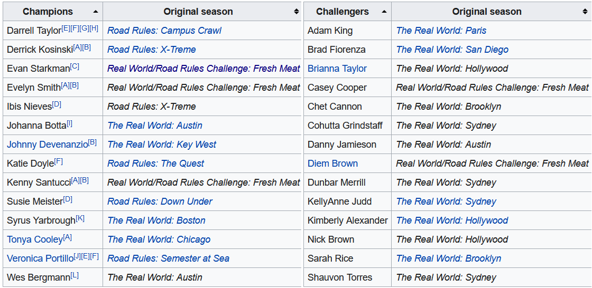
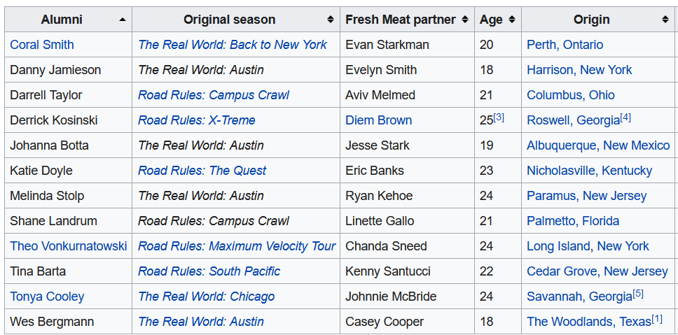
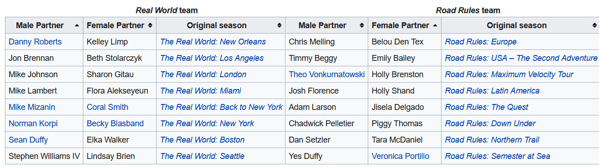

```{r setup, include=FALSE}
knitr::opts_chunk$set(echo = TRUE, warning = FALSE, message = FALSE, error = FALSE)
library(knitr)
```

Since 1998, [MTV's The Challenge](https://en.wikipedia.org/wiki/The_Challenge_(TV_series)) (formerly the Real World/Road Rules Challenge) has graced the airwaves where it is currently in Season 37.  In a prior [post](https://jlaw.netlify.app/2021/03/01/exploring-wednesday-night-cable-ratings-with-ocr/) I had mentioned that this is one of my guilty pleasure shows so this will likely not be the last post that is based around the Challenge.

For casting the show, the early years revolved around having alumni from MTV's The Real World and Road Rules compete against each other (in an odd bit of irony or misnaming, the first season called Real World: All Stars actually consisted of **only** Real World alumni).  Over the next 37 seasons, the series has evolved bringing in other MTV properties such as "Are You the One?" and expanding internationally to properties like "Survivor: Turkey" and "Love Island UK".

Since the cast of characters has continuously evolved over the 37 seasons, I thought it would be interested to see if I can algorithmically classify the eras of the show based on the cast of each season through Hierarchical Clustering and visualizing using UMAP.

## Libraries
```{r libraries}
library(tidygraph) # For manipulating network data sets
library(ggraph) # For visualizing network data sets
library(tidyverse) # General Data Manipulation
library(rvest) # For webscraping data from wikipedia
library(widyr) # For calculating cosine similarity of seasons
library(umap) # For dimensionality reduction

```

## Getting the Data

Since the goal is to cluster the seasons of the The Challenge based on similarity of their casts, I need to get the cast list from each of the 37 seasons.  Fortunately, Wikipedia contains the casts within each season's page.  Unfortunately, I'm lazy and really don't want to specifically hunt down the URLs for each of 37 seasons and write individual rvest code.  So I'll use the [Seasons](https://en.wikipedia.org/wiki/The_Challenge_(TV_series)#Seasons) table on Wikipedia to act as a driver file for each season's page using `rvest` to extract the table using its xpath, pulling out all of the anchor elements (<a>) *html_attrs()* to extract all of the attributes into a list and using `purrr`'s `map_dfr` function to combine all of the links into a list.  Unforunately, there are multiple links on row of the table (one for the title and one of the location of the season), so using `stringr`'s *str_detect*, I'll keep only the rows that has the word "Challenge" in the title.  Or "Stars" in the case of the first season which was just called "Road Rules: All-Stars".

```{r driver}
seasons <- read_html('https://en.wikipedia.org/wiki/The_Challenge_(TV_series)') %>%
  html_element(xpath = '/html/body/div[3]/div[3]/div[5]/div[1]/table[2]') %>% 
  html_elements('a') %>% 
  html_attrs() %>% 
  map_dfr(bind_rows) %>% 
  filter(str_detect(title, 'Challenge|Stars')) %>%
  select(-class)
```

```{r driver_tbl, echo=FALSE}
kable(
  seasons %>% head(3)
)
```


The dataset now has the Wikipedia link for each season in the *href* column and a more human-reading title in the *title* column.

The next problem to tackle is iterating through each season to extract the cast table.  The issue here is that the Cast table is not uniform on each season's page and the cast table is not always the same ordered table.  In fact, there are three classes of tables to have to deal with:

1. Multiple Tables - Single Names

For many of The Challenge seasons there are two teams (originally Real World vs. Road Rules but eventually taking on other themes like Rookies vs. Vets, Champions vs. Challengers, etc.).  In this cases, there are two tables to exact with each table having one column for cast the member name.



2. Single Table - Two Names

In seasons where there are pairs instead of teams, such as Fresh Meat, Rivals and Battle of the Exes, there will be one table for the cast but two columns of names to extract. 



3. Multiple Tables - Two Names

In the original Battle of the Seasons there were pairs (one male and one female from each season) that were also classified into teams (Real World or Road Rules).  For this season, there were two tables to extract and each with two columns, one for the male and one for the female.



There was no easy way (or at least one that I wanted to deal with) to automatically classify each of the 37 seasons into these three types so I manually looked at all 37 season Wikipedia pages and coded in which tables to extract and which columns to extract within each table.

```{r table_metadata}
## Set up which tables and columns to extract from WikiPedia
seasons <- seasons %>%
  mutate(
    season_num = row_number(), #Define Season Identifier
    table_num = case_when(
      season_num %in% c(1, 12, 16, 19) ~ '2',
      season_num %in% c(27) ~ '3',
      season_num %in% c(2, 4, 5, 6, 9, 11) ~ '4,5',
      TRUE ~ '3, 4'
    ),
    keep_cols = case_when(
      season_num %in% c(5) ~ '1, 2',
      season_num %in% c(12, 19, 27) ~ '1, 3',
      TRUE ~ '1'
    )
  )

```

For example, the default was Multiple Tables - One Column where the two tables were the 3rd and 4th tables on the page and we only needed the first column.

With this additional metadata, I could now write a function to read the URL and extract the correct tables and table columns:

```{r extract_function}
### Write Function to Scrape the Names
get_cast <- function(url, table_num, keep_cols, title, order){
  
  ##Convert the String Inputs into a numeric vector
  table_num = str_split(table_num, ',') %>% unlist() %>% as.numeric()
  keep_cols = str_split(keep_cols, ',') %>% unlist() %>% as.numeric()
  
  #Read Page and Filter Tables
  ct <- read_html(paste0('https://en.wikipedia.com/',url)) %>%
    # Extract Table Tags
    html_elements('table') %>%
    # Keep only the specified tables
    .[table_num] %>% 
    # Extract the information from the tables into a list (if more than 1)
    html_table() %>% 
    # Use MAP to keep only the selected columns from each table
    map(~select(.x, all_of(keep_cols)))
  
  #If Keeping Multiple Columns Gather to a Single Column Called Name
  if(length(keep_cols) == 1){
    ct <- ct %>% 
      map(~rename(.x, "Name" = 1)) 
  }else if(length(keep_cols) > 1){
    ct <- ct %>%
      map(~gather(.x, "Field", "Name")) %>% 
      map(~select(.x, 2)) 
  }
  
  # Combine all the tables into 1 columns and append title column
  ct <- ct %>% map_dfr(bind_rows) %>% mutate(title = title, order = order)

  return(ct)
  
}
```

The five parameters passed to this function are all contained in the driver file created above.  In order to iterate through the seasons to create a data set of the cast members I'll use the `pmap_dfr()` function from `purrr` to provide more than two inputs to a function (pmap vs. map and map2) and combine all the outputs into a single data frame by binding the rows (the dfr part of the function name).

In pmap, the first parameter is a list of the various parameters to pass to the function and the second parameter is the function to be called.  The elements of the list can then be referred to as ..1 being the href parameters (first parameter from the list), ..2 the table_name parameter, and so on.

```{r pmap}
###Create Dataset with all names
all_cast <- pmap_dfr(list(seasons$href, 
                          seasons$table_num, 
                          seasons$keep_cols,
                          seasons$title,
                          seasons$season_num), 
                     ~get_cast(..1, ..2, ..3, ..4, ..5))
```

The results of this new table now looks like:

```{r results, echo=FALSE}
kable(
  all_cast %>% head(3)
)
```

### Cleaning the Data and Final Preparations

The data on Wikipedia is *fairly* clean but there are places where automation is no substitute for domain knowledge.  In this case the cast tables refer to what people were called in that specific season.  But in some cases as cast members have returned for multiple seasons what they have been called has changed.  For example. the now host of NBC's First Look, Johnny “Bananas” Devenanzio, began his time on The Challenge as "John Devenanzio", then "Johnny Devenanzio
", and finally, "Johnny 'Bananas' Devenanzio" for his most recent 12 seasons.  Some female cast members married as "Tori Hall" became "Tori Fiorenza".  And in the most subtle of changes, "Nany González" appears both with and without the accent over the "a" (huge shoutout to the [r/MtvChallenge](https://www.reddit.com/r/MtvChallenge/comments/pj8by1/oc_visualizing_the_most_frequently_appearing/) sub-reddit for calling me out on that when it cause Nany to not appear in my data visualization).

Other changes are less interesting such as removing footnotes from people's names, fixing that in the Seasons table both Season 5 and Season 23 are called "Battle of the Seasons", and appending the season's names onto the cast table

```{r data_cleaning}
###Clean up the Cast Member Columns and Clean up The Title Columns
###Domain Knowledge that these are all the same people (especially the married ones)
all_cast_clean <- all_cast %>%
  mutate(
    #Remove Footnotes
    Name = str_remove_all(Name, '\\[.*\\]'),
    #Fix the Various References to Johnny Bananas
    Name = if_else(str_detect(Name, 'John.* Devenanzio'),'Johnny "Bananas" Devenanzio',Name),
    Name = if_else(str_detect(Name, 'Jordan.*Wiseley'), 'Jordan Wiseley', Name),
    Name = if_else(str_detect(Name, 'Natalie.*Duran'), 'Natalie "Ninja" Duran', Name),
    Name = if_else(str_detect(Name, 'Theresa Gonz'), 'Theresa Jones', Name),
    Name = if_else(str_detect(Name, 'Tori Fiorenza'), 'Tori Hall', Name),
    Name = if_else(str_detect(Name, 'Nany'), 'Nany González', Name)
  )

##Season Table
seasons_table <- read_html('https://en.wikipedia.org/wiki/The_Challenge_(TV_series)') %>%
  html_element(xpath = '/html/body/div[3]/div[3]/div[5]/div[1]/table[2]') %>%
  html_table() %>%
  janitor::clean_names() %>%
  mutate(year = str_extract(original_release, '\\d{4}') %>% as.integer()) %>%
  select(order, short_title = title, year) %>%
  distinct() %>%
  mutate(short_title = if_else(order == 23, 'Battle of the Seasons 2', short_title))


all_cast_info <- all_cast_clean %>%
  left_join(seasons_table, by = "order")
```

## Exploring the Data

Before getting into the real meat of the analysis, I'm going to do some quick EDA to answer some potentially interesting questions about The Challenge Cast that we can see in the data.

### Who Has Been on the Most Challenges?

A quick question might be what challenger has been on the most seasons.  This can be answered pretty quickly with the `count()` function from `dplyr`.

```{r most_challenges}
all_cast_info %>%
  count(Name, sort = T) %>%
  head(7) %>%
  ggplot(aes(x = fct_reorder(Name, n), y = n, fill = Name)) + 
    geom_col() + 
    geom_text(aes(label = n, hjust = 0)) +
    ghibli::scale_fill_ghibli_d(name = 'LaputaMedium', guide = 'none') + 
    scale_y_continuous(expand = expansion(mult = c(0, .1))) + 
    coord_flip() + 
    labs(x = "Challenger", y = "# of Appearances", 
         title = "Who Has Been on the Most Seasons of the Challenge?") + 
    cowplot::theme_cowplot() + 
    theme(
      plot.title.position = 'plot'
    )
```
As any Challenge fan knows, Johnny Bananas has been on the most seasons with 20 and CT just behind at 19.

## Looking at Consecutive Season Behavior

An interesting visualization we can do is to explore how frequently Challengers are on consecutive seasons using a series of dumbbell plots.  In this plot there will be a point for each endpoint of a stretch of consecutive seasons and they will be connected by a line.

Check out the post on the [r/MtvChallenge](https://www.reddit.com/r/MtvChallenge/comments/pj8by1/oc_visualizing_the_most_frequently_appearing/) sub-reddit for a nicer (although slightly wrong) version of this plot.

```{r dumbbell, fig.height=12, fig.width=8}
all_cast_info %>% 
    ## Add the number of seasons for each challenger as a new column
    add_count(Name, name = 'num_seasons') %>%
    # Filter to only those who have been on 7+ seasons
    filter(num_seasons >= 7) %>%
    # For each challenger define consecutive segments based on when the prior
    # season number is more than 1 or missing (for the first observation)
    group_by(Name) %>%
    arrange(order, .by_group = T) %>%
    mutate(
      diff = order - lag(order),
      new_segment = if_else(is.na(diff) | diff > 1, 1, 0),
      run = cumsum(new_segment)
    ) %>% 
    # Define the endpoints of each segment
    group_by(Name, run) %>% 
    summarize(start = min(order),
              end = max(order),
              num_seasons = max(num_seasons)) %>%
  ggplot(aes(x = fct_rev(fct_reorder(Name, start, min)), 
             color = Name, fill = Name)) + 
    geom_linerange(aes(ymin = start, ymax = end), size = 1) + 
    geom_point(aes(y = start), size = 2) + 
    geom_point(aes(y = end), size = 2) + 
    scale_fill_discrete(guide = 'none') + 
    scale_color_discrete(guide = 'none') +
    scale_y_continuous(breaks = seq(1, 37, 2)) + 
    labs(x = "", y = "Seasons", title = "How Often Were Challengers On The Show?",
         subtitle = "*Only Challengers Appearing On At Least 7 Seasons Ordered By First Appearance*",
         caption = "*Source:* Wikipedia | **Author:** Jlaw") + 
    coord_flip() + 
    cowplot::theme_cowplot() + 
    theme(
      panel.grid.major.y = element_line(size = .5, color = '#DDDDDD'),
      plot.title = element_text(hjust = .5),
      plot.caption = ggtext::element_markdown(),
      plot.subtitle = ggtext::element_markdown(hjust = .5),
      axis.ticks.y = element_blank()
    )


```

## Which Seasons Had the Highest Percentage of "one and done" Challengers?

Sometimes the show will bring a cast member on and it doesn't work out and you never see them again.  I can also look at which seasons had the largest number of cast members who were never seen again.  Since Season 37 is still airing and we don't know who will / won't come back, I've excluded that season:

```{r one_and_done, fig.height=8}
all_cast_info %>% 
  add_count(Name, name = "num_seasons") %>%
  filter(num_seasons == 1 & order != 37) %>%
  count(short_title, year) %>% 
  ggplot(aes(x = fct_reorder(short_title, n), y = n, fill = year)) + 
    geom_col() + 
    geom_text(aes(label = n), hjust = 0) +
    labs(x = "Season Title", y = "Number of 'one and done' Challengers",
         title = "What Season Had the Most 'One and Done' Challengers",
         subtitle = "Lighter Colors are Later Seasons",
         fill = "Season Airing") +
    expand_limits(x = 0, y = 0) + 
    coord_flip() + 
    cowplot::theme_cowplot() + 
    theme(
        legend.position = 'bottom'
    )
```

The seasons with the largest number of one and done's tended to be seasons where the shows had large influxes of new challengers due to different formats.  Battle of the Seasons was a very large cast and the first to not have small teams.  Battle of the Bloodlines was a concept where 50% of the challengers were family members who had never been on the show and thankfully never were again.

## What Are the Most Similar Episodes of the Challenge?

I can visualize season similarity in a network graph, however, I need to first restructure the data.  Right now I just have all the positive cases but I need to build data that has every person/season combination with 1/0 indicators.  Then I can use the `pairwise_similarity()` function from `widyr` to get the consine similarity of each season.  The `upper=F` setting makes it so there's only 1 row for each combination (e.g, only A, B rather than both A,B and B,A):

```{r similarity}
similarity <- all_cast_info %>%
  #Create an indicator for all the positive cases
  transmute(order, short_title, Name, ind = 1) %>%
  # Make a wide data set and fill in 0s for all the negative cases
  pivot_wider(
    names_from = 'Name',
    values_from = 'ind',
    values_fill = 0
  ) %>% 
  # Bring the table back to long format with 1/0s
  pivot_longer(
    cols = c(-order, -short_title),
    names_to = "Name",
    values_to = "ind"
  ) %>% 
  pairwise_similarity(short_title, Name, ind, upper = F, diag = F) %>% 
  arrange(-similarity)  %>%
  filter(similarity > .29)

```

```{r show_similarity}
similarity %>% head(3) %>% kable()
```
The most similar seasons in the data are Vendettas (Season 31) and Final Reckoning (Season 32) which makes sense as these were consecutive seasons that were also the last two pieces of a trilogy.

The similarity threshold of 0.29 was chosen judgmentally to include as many seasons as possible without over-complicating the graph.  The next step in building the network graph itself.  I'm setting a seed since the layout in `ggraph` is non-deterministic and I'd like to make it reproducible.  The similarity dataframe is converted to a tbl_graph object with `as_tbl_graph`, I join in the short titles to from the labels and then set edges to have alpha values (transparency) tied to similarity and use the names for the node labels.

```{r network_graph, fig.width=12, fig.height=12}
set.seed(20210904)
as_tbl_graph(similarity) %>%
  #mutate(community = as.factor(group_infomap())) %>%
  left_join(seasons_table, by = c('name' = "short_title")) %>%
  ggraph(layout = 'fr') + 
    geom_edge_link(aes(alpha = similarity), width = 1.5) + 
    geom_node_label(aes(label = name, fill = order), size = 5) + 
    scale_fill_viridis_c(begin = .3) + 
    scale_shape_discrete(guide = 'none') + 
    labs(title = "Network of Challenge Seasons",
         subtitle = "Edges measured by Cosine Similarity of Cast",
         caption = "All Stars and RW vs RR did not have >.0.29 Similarity to Any Other Season",
         alpha = "Cosine Similarity",
         fill = "Season #") + 
    theme_graph() + 
    theme(
      legend.position = 'bottom'
    )
```
Through the network graph we can see that the first two seasons aren't connected to anything and don't appear and then Seasons 3 and 5 and Seasons 4 and 6 exist in their own clusters.  But the rest of the structure you can trace from early seasons to later season.

## Clustering the Seasons with Hierarchical Clustering

Now that EDA is done, its time to determine our eras through clustering.  In order to use hierarchical clustering I need to create a distance matrix. So do so I will replicate some of the code from above where each row will be a season and each column a Challenger and the value will be either 1 if they were on that season or 0 otherwise.

Since this data is binary I will be using a binary distance where 1 and 1 is a match and anything else is a mismatch (e.g, 0 and 0 despite being the same value does not count as similarity).  The definition is the proportion of bits in which only one is one among those where at least one is one.

Then the hierarchical clustering algorithm is run with `hclust`.  There are many different agglomeration methods that can be used ranging from single (where difference between clusters is defined by their closest elements), complete (which defines differences by farthest apart elements), average (which is the average of all the points distance), and Ward which is the minimal distance beween sum of squres.  For more information, see this [CrossValidated](https://stats.stackexchange.com/questions/195446/choosing-the-right-linkage-method-for-hierarchical-clustering/217742#217742) answer.

```{r hclust}
# Cast Data to Wide Format
dt <- all_cast_info %>%
  transmute(order, short_title, Name, ind = 1) %>%
  pivot_wider(
    names_from = 'Name',
    values_from = 'ind',
    values_fill = 0
  )

# 
dst <- dt %>%
  # Remove fields I don't want part of the distance function
  select(-order, -short_title) %>%
  dist(method = 'binary') %>%
  #the agglomeration method to be used. 
  # This should be (an unambiguous abbreviation of) one of "ward.D", 
  #"ward.D2", "single", "complete", "average" (= UPGMA), "mcquitty" (= WPGMA),
  #"median" (= WPGMC) or "centroid" (= UPGMC).
  hclust(method = 'ward.D2')

```

I can then visualize the resulting dendrogram using the `plot()` function and supplying the short_title field I can previously excluded as a label parameter.  By looking at the dendrogram it seems like there are five clusters which I will highlight with the `rect.hclust` function and specifing k=5:

```{r dendrogram}
plot(dst, labels = dt$short_title, 
     main = 'Hierarchical Clustering of Challenge Seasons',
     xlab = '')
rect.hclust(dst, k = 5)

```
Based on the dendrogram, there are five clusters:

* Cluster 1: Seasons 1 (All Stars) through 11 (Gauntlet 2)

This are the originals before they brought in people who weren't on either Real World or Road Rules

* Cluster 2: Seasons 12 (Fresh Meat) through 18 (The Ruins)

Fresh Meat is the first season where people not appealing on a prior MTV show joined.  This group of new people also formed a core backbone of the show for the next block of seasons.

* Cluster 3: Seasons 19 (Fresh Meat 2) through Season 26 (Battle of the Exes 2)

In Fresh Meat 2, they again introduce half of the cast that were new.

* Cluster 4: Seasons 27 (Battle of the Bloodlines) through Season 32 (Final Reckoning) 

Battle of the Bloodlines, similar to Fresh Meat, was a season where half the cast was new.  Although this time they were family members rather than unaffiliated challengers.

* Cluster 5: Season 33 (War of the World) through Season 37 (Current Season)

War of the Worlds was again a large influx of new cast members 

So it seems like the algorithm latched on to changepoints where the casts became heavily rookies, which would make sense since that is a forced dissimilarity.

Going back to the data, I can then add the get the cluster results through the `cuttree` function and providing it with the k=5 value and add it back to the original dataset with `mutate()`:

```{r add_cluster}
h_clust_results <- dt %>%
  mutate(cluster = cutree(dst, k = 5))
```

## Dimensionality Reduction with UMAP

The data set used for the clustering contained 37 rows representing each season of The Challenge and 360 columns representing every challenge who has ever been on the show.  This type of data is prime for dimensionality reduction.  Uniform Manifold Approximation and Projection (UMAP) is a dimensional technique that can be used for dimensionality reduction and visualization similar to T-SNE.  The UMAP algorithm can be found in the `umap` package.

Running UMAP is pretty straightforward with the `umap()` function and here I provide it the very wide data set used for cluster.  In the returned object there is an element called *layout* which contains the compressed two dimensional space returned by UMAP.

```{r umap}
set.seed(20210904)
ump <- umap(dt %>% select(-order, -short_title))
```

I can add those dimensions to the clustering results from above to see how closely the UMAP compression will match the clustering from the `hclust` function:

```{r umap_viz}
h_clust_results %>% 
  select(order, short_title, cluster) %>%
  mutate(
    dim1 = ump$layout[, 1],
    dim2 = ump$layout[, 2]
  ) %>%
  ggplot(aes(x = dim1, y = dim2, color = factor(cluster))) + 
  geom_text(aes(label = short_title)) + 
  labs(title = 'UMAP Projection of Challenge Seasons',
       subtitle = "Colors Represent Prior Clustering") + 
  scale_color_discrete(guide = 'none') + 
  cowplot::theme_cowplot() + 
  theme(
    axis.ticks = element_blank(),
    axis.text = element_blank()
  )

```
Overall, the UMAP projection captures similar information to the clustering since both methods were unsupervised and the colors (the prior clusters) are very close in the UMAP projected space.

### Predicting New Observations with UMAP

In the summer of 2020, [THe Challenge: All Stars](https://en.wikipedia.org/wiki/The_Challenge:_All_Stars) aired on Paramount+.  The series was intended to bring back fan favorites from early seasons of the challenge (although whether the actual cast would be considered fan favorites, all-stars, or from early seasons was debatable).  An interesting final question to ask is: *what cluster would The Challenge: All Stars belong to in the UMAP space?*.

This next block of code is going to do a lot of heavy lifting but isn't dissimilar from what was done in the earlier parts of this post.  I will be downloading the cast from Wikipedia, cleaning it (more marriages and nicknames), and adding it to the original data set to get the 0 cases and the filtering it back to The Challenge: All Stars season.

```{r all_stars}
all_stars <- 
  # Take Original Data Set
  all_cast_info %>%
  # Add Indicators
  transmute(order, short_title, Name, ind = 1) %>%
  # Get the New Challenge Season
  bind_rows(
    get_cast('wiki/The_Challenge:_All_Stars', '3, 4', '1', 'The Challenge: All Stars', 99)  %>%
      transmute(order, short_title = title, Name, ind = 1)  %>%
      #Cleaning Names
      mutate(
        Name = case_when(
          Name == "Katie Cooley" ~ "Katie Doyle",
          Name ==  'Eric "Big Easy" Banks' ~ 'Eric Banks',
          Name == 'Teck Holmes' ~ 'Tecumshea "Teck" Holmes III',
          TRUE ~ Name
        )
      )
  ) %>% 
  # Cast to Wider
  pivot_wider(
    names_from = 'Name',
    values_from = 'ind',
    values_fill = 0
  ) %>% 
  # Filter back to the All Stars Season
  filter(short_title == 'The Challenge: All Stars') %>%
  # Removing Things that Won't Be Predicted
  select(-order, -short_title)

```

Then predicting the All Stars season in the UMAP space can be done similar to other predictions in R with the `predict` function:

```{r predict}
all_stars_pred <- predict(ump, all_stars)

```

which returns a matrix with 1 row for the reason and 2 columns for the UMAP x and y dimensions.  Then this can be visualized on top of the original UMAP projection.

```{r viz_new_umap}
# Take Original Data
h_clust_results %>% 
  select(order, short_title, cluster) %>%
  # Add in the original UMAP data
  mutate(
    dim1 = ump$layout[, 1],
    dim2 = ump$layout[, 2]
  ) %>%
  ggplot(aes(x = dim1, y = dim2, color = factor(cluster))) +
  #ggrepel::geom_text_repel(aes(label = short_title)) + 
  geom_text(aes(label = short_title)) +
  # Add Annotation for the Challenge All Stars Season with the predicted
  # projection.
  annotate(
    'label',
    label = 'The Challenge: All Stars',
            x = all_stars_pred[, 1],
            y = all_stars_pred[, 2],
            color = 'black') + 
  labs(title = 'Predicting Challenge All-Stars Onto Prior UMAP Projection',
       subtitle = "Colors Represent Prior Clustering") + 
  scale_color_discrete(guide = 'none') + 
  scale_fill_discrete(guide = 'none') + 
  cowplot::theme_cowplot() + 
  theme(
    axis.ticks = element_blank(),
    axis.text = element_blank()
  )


```
It seems like Challenge All-Stars would be part of the first cluster of the original group of seasons but is somewhat between the "green cluster" which could make sense as there were a couple of cast members on the show who first showed up in Battle of the Seasons 2.

