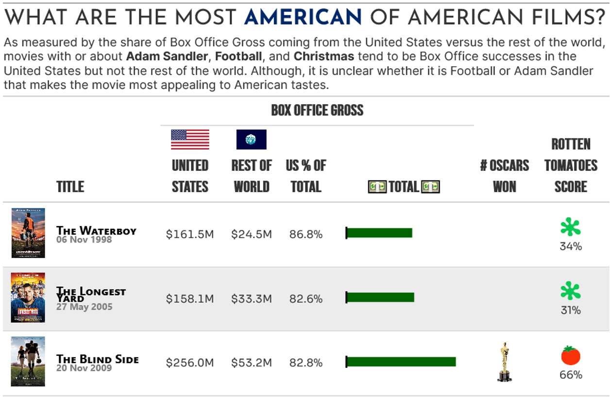
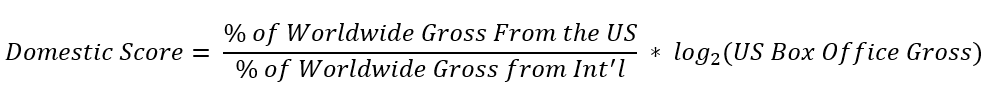
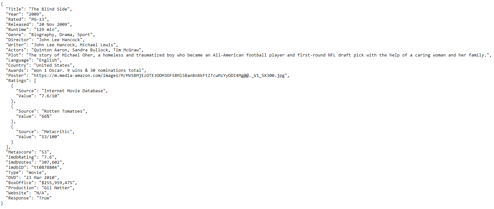

```{r setup, include=FALSE}
knitr::opts_chunk$set(echo = TRUE, warning = FALSE, message = FALSE, error = FALSE)
library(knitr)
```




**I love movies**.  I enjoy watching them, I enjoy reading about the industry (sometimes), and as a bit of a data-nerd (exhibit a: [my blog](https://jlaw.netlify.app)), I enjoy learning about the outliers in the industry.  One of my favorite trends to follow is the shifting dynamics of Hollywood being driven more by International Box Office and the impact this has on the types of movies being made.  One of my favorite examples is the movie [Warcraft](https://www.boxofficemojo.com/title/tt0803096/?ref_=bo_se_r_1).  From a critical perspective the movie is not good sporting a [Rotten Tomatoes score](https://www.rottentomatoes.com/m/warcraft) of 28% (although the audience score is 76%).  However, there is a massive disparity in the box office gross with only $47M of its $439M coming from the United States.  Ultimately, this movie was a failure in the US but incredibly popular internationally.

With the announcement of the [RStudio 2021 Table Contest](https://blog.rstudio.com/2021/09/30/rstudio-table-contest-2021/), I wanted to look into identifying what are the movies that were the successful abroad but a failure in the US.  But after playing with the data a bit I decided to flip the question to ask **what is the most "American" movie**.  That is what were the most successful movies in the US that did not perform well abroad.

# Part 1: Gathering the Data

[Box Office Mojo](https://www.boxofficemojo.com/chart/ww_top_lifetime_gross/?offset=0) has a table with the Top 1000 grossing movies with their split between Domestic and International grosses.  This table should form the best backbone of finding successful US movies.  However, since the most "American" movie could be anywhere in the Top 1000, I'll need to gather all 1000.

## Loading Libraries

Aside from `tidyverse` the main package needed to extract this table will be `rvest` which is used for tidy web scraping.  The `glue` package will be used to make string construction a bit easier and `httr` will be used to access the [Open Movie Database API](https://www.omdbapi.com) to augment the initial Box Office gross data.

```{r libraries_1}
library(rvest) # Scrape Table From BoxOfficeMofo
library(tidyverse) # Data Manipulations
library(glue) # String Interpolation
library(httr) # Accessing the OMDB API
```

Since the Box Office Mojo table is paginated, I'll need a loop to get through all 1000.  The starting point for the table is controlled by the offset parameter in the URL.  The `map_dfr` function from `purrr` will make it very easy to loop through the different offset parameters and combine each run into a single data set.

I'll be feeding `map_dfr` parameter values of 0, 200, 400, 600, and 800 iteratively and passing it into the Box Office Mojo URL.  The `glue()` function allows me to insert the offset value directly into the string through the `{}`.  In this code block each iteration:

1. Grabs an offset parameter (0 to 800, by 200)
2. Passes that into an anonymous function that as the parameter `x`
3. Runs `read_html()` on the URL with the offset and extracts the *table* element with `html_elements()`
4. Extract the information from the table with `html_table()` into a tibble
5. When I get to the OMDB API piece rather than searching by title I can search directly by IMDB ID and since Box Office Mojo is owned by IMDB, I'm going to extract the ID from the links in the table:
    + From the previously extracted *table* element, extract the *<a>* tags with `html_elements()` and extract the *href* attributes from those *<a>* tags using `html_attr()`.
    + Since `html_attr()` returns **all** the *href* attributes as a vector, not just the IMDB ids, I use `keep()` from `purrr` to only keep the elements that contain the string "tt" as all IMDB Ids start with "tt".
    + Then finally, I pull the "tt" and the numeric portion out of the vector using `str_extract()` from `stringr`.
  

```{r boxoffice_mojo, cache=TRUE}
# Iterate through 0 to 800 by 200 and pass as X into the function
tbl <- map_dfr(seq(0, 800, 200),
               function(x){
                 #Read URL
                 base <- glue("https://www.boxofficemojo.com/chart/ww_top_lifetime_gross/?offset={x}") %>%
                   read_html() %>% 
                   # Extract Table Structure
                   html_element('table')
                 
                   bind_cols(
                     #Get Actual Table Data
                     base %>% html_table(convert = F),
                     
                     #Get IMDB IDs From Links
                     imdb_id = base %>% 
                       html_elements('a') %>% 
                       html_attr('href') %>%
                       keep(~str_detect(.x, 'tt')) %>%
                       str_extract('tt\\d+')
                     
                   )
               })

```

In order to get the `html_table()` piece to work correctly, I needed to set `convert=F` which tells the function not to try to turn numeric-looking values into numbers.  Since everything was read in as a character, I need to do some light data cleaning using the `parse_number()` function from `readr` to turn characters that look like numbers into numbers.

I'll also need to define what I mean when I say a movie is the "Most American".  What I want is to find movies that did well in the US and didn't do well abroad.  But...

* If I look at the highest percentage of Domestic Gross I'll get movies that might not have had an International release or did not have a large US gross (and therefore might not have been successful in the US)
* If I look at the highest differences between US and International Gross I might find things that made a lot of money both Domestically and Internationally but just more domestically.

In order to find a balance between the two, I create the "domestic score" which is ratio of the percent of Worldwide Gross that was Domestic to the percent of Worldwide Gross that was International (in order to maximum "US-centric movies) but also to weight this ratio by the *log2* of the Domestic Lifetime Gross in order to make sure that we're finding successful movies and not just small movies that were only released in the US.

<center>

</center>

Then since I want my results to be in a table I don't need all 1,000 movies, so I'll use `arrange()` and `head()` to grab the Top 5 by the domestic score.

```{r bom_cleaning}
tbl_clean <- tbl %>% 
  janitor::clean_names() %>% 
  mutate(
    rank = parse_number(rank),
    worldwide_lifetime_gross = parse_number(worldwide_lifetime_gross),
    domestic_lifetime_gross = parse_number(domestic_lifetime_gross),
    domestic_percent = parse_number(domestic_percent)/100,
    foreign_lifetime_gross = parse_number(foreign_lifetime_gross),
    foreign_percent = parse_number(foreign_percent)/100,
    year = parse_number(year),
    # Developing a way to get the highest domestic percentages that also did well domestically
    domestic_score = (domestic_percent / foreign_percent)*log2(domestic_lifetime_gross)
  ) %>%
  arrange(-domestic_score) %>%
  # Keep The Top 10 As Candidates for the API
  head(5)
```

To make this table a little more fun there's a couple elements that I'd like to bring in from the [Open Movie Database](https://www.ombdapi.com) such as the Rotten Tomatoes score, release dates, awards, and URL for the movie's poster.  In order to use the API you first need to register for an API key.  I've stored that in my *.Renviron* file so I can place it into glue.

To use the API I can search for movies using the IMDB Id that I had gotten from above which gets used as part of the *i=* parameter to the URL which gets passed to the `GET()` function from the `httr` package.  The information for the 5 movies from above get passed in using the `map_dfr()` function.  The anonymous function takes in the IMDB id and returns a tibble that contains the extra information that I wanted for the table.


```{r omdb, cache = TRUE}
###Use OMDB Data for the Country Filters and Poster Data
omdb_data <- map_dfr(tbl_clean$imdb_id,
                      function(id){
                        omdb_resp <- GET(URLencode(glue("https://www.omdbapi.com/?apikey={Sys.getenv('OMDB_API_KEY')}&i={id}&type=movie&r=json")))
                        if(content(omdb_resp)$Response == "True"){
                          return(
                            content(omdb_resp, as = 'parsed') %>% 
                              tibble(
                                imdb_id = id,
                                api_title = .$Title,
                                release_date = .$Released,
                                runtime = .$Runtime,
                                language = .$Language,
                                country = .$Country,
                                awards = .$Awards,
                                poster_url = .$Poster,
                                ratings_source = ifelse(length(.$Ratings) > 0,
                                                        .$Ratings[[2]]$Source,
                                                        "missing"),
                                rating = ifelse(length(.$Ratings) > 0,
                                                .$Ratings[[2]]$Value,
                                                "-99")
                              ) %>% select(-.) %>% distinct() 
                          )
                        }
                      })
```

The raw JSON returned from the API looks like:


and output of the OMDB data table looks like:

```{r omdb_example, echo = FALSE}
omdb_data %>% 
  filter(api_title == "The Blind Side") %>% 
  gather(field, value) %>% 
  kable(align = 'c')

```

With the Box Office Data and the OMDB Data in separate data sets, I can combine them together through the common IMDB id.  Finally, I'll keep only movies listed as the United States (can't be American if not at least partially made in the good ol USA) and I'll extract the number of Oscars won our of the awards string to be used later.


```{r combined}
#Combine All Data
combine_dt <- tbl_clean %>% 
  inner_join(omdb_data, by = "imdb_id") %>%
  #Keep US Movies
  filter(str_detect(country, "United States")) %>%
  extract(awards, "num_oscars", "Won (\\d+) Oscar", remove = F, convert = T) %>%
  replace_na(list(num_oscars = 0))

```

With the data set constructed, now onto the table.

# Part 2: Constructing the Table

The libraries used to construct the table are `gt` and `gtExtras`

```{r tbl_libraries}
library(gt)
library(gtExtras)
```

I plan to use images for the number of Oscars won, the Rotten Tomatoes score (fresh or rotten), and flags to show the Domestic Box Office and International Box Office so rather than have long URLs in the table construction itself, I'll create constant variables and refer to those in the code:

```{r constants}
ROTTEN_URL = 'https://www.rottentomatoes.com/assets/pizza-pie/images/icons/tomatometer/tomatometer-rotten.f1ef4f02ce3.svg'
FRESH_URL = 'https://www.rottentomatoes.com/assets/pizza-pie/images/icons/tomatometer/tomatometer-fresh.149b5e8adc3.svg'
OSCAR_URL = 'https://upload.wikimedia.org/wikipedia/en/7/7f/Academy_Award_trophy.png'
US_FLAG_URL = 'https://upload.wikimedia.org/wikipedia/en/thumb/a/a4/Flag_of_the_United_States.svg/188px-Flag_of_the_United_States.svg.png'
WORLD_FLAG_URL = 'https://upload.wikimedia.org/wikipedia/commons/thumb/3/3b/EarthFlag1.svg/525px-EarthFlag1.svg.png'

```

Since `gt` has a lot of syntax, I'll combine a bunch of steps together rather than showing each individual change.  But the start of the table is just the `gt()` function.

```{r read_orig_file, include = F}
#Since newer movies have been added since this was originally devised, this data set keeps the table results
combine_dt <-  readRDS('box_office_data.RDS') %>% head(5)
```


```{r gt1}
p <- combine_dt %>%
  select(poster_url, title, release_date, domestic_lifetime_gross, foreign_lifetime_gross,
         domestic_percent, worldwide_lifetime_gross, num_oscars, rating) %>%
  gt() 
```
```{r echo = F}
gtsave(p, filename = "p1.html")
```

```{r echo = F}
htmltools::tags$iframe(
  src = "p1.html", 
  scrolling = "no", 
  seamless = "seamless",
  frameBorder = "0",
  height=350,
  width=800
)
```

At first this is pretty ugly as a table but fortunately `gt` and `gtExtras` have a lot of very convenient features to make the table very pretty very quickly.  The first set of steps will be:

* Turn the URL to the movie poster into the action poster with `gt_img_rows()` from `gtExtras`
* Turn the domestic percentage field to a percent format with `fmt_percent()` from `gt`
* Turn the Domestic and Foreign Box Office Gross Values to dollar in millions with `fmt_currency` from `gt`
* Turn the Worldwide Lifetime Gross into a bar plot with `gt_plt_bar()` from `gtExtas`

```{r gt2}
p <- combine_dt %>%
  select(poster_url, title, release_date, domestic_lifetime_gross, foreign_lifetime_gross,
         domestic_percent, worldwide_lifetime_gross, num_oscars, rating) %>%
  gt() %>%
  
  #New Code
  gt_img_rows(poster_url, height = 75) %>%
  fmt_percent(domestic_percent, decimals = 1) %>%
  fmt_currency(columns = c("domestic_lifetime_gross", "foreign_lifetime_gross"),
               suffixing = T, decimals = 1) %>%
  gt_plt_bar(worldwide_lifetime_gross, color = 'darkgreen', width = 50)
```
```{r echo = F}
gtsave(p, filename = "p2.html")
```

```{r echo = F}
htmltools::tags$iframe(
  src = "p2.html", 
  scrolling = "no", 
  seamless = "seamless",
  frameBorder = "0",
  height=540,
  width=800
)
```

The next steps will use the `text_transform` functions from `gt` to turn the number of Oscars won into the literal Oscar image for each Oscar won, and for the Rotten Tomatoes score, I'll use with the "Fresh" image if the score is above 60% or the "Rotten" image if below 60%.

In general the `text_tranform()` function takes two parameters.  The first is where is the function will be applied.  In the first example, `locations = cells_body(rating)` means that I will apply the function defined in `fn` to the *rating* column.  Then for the `fn` I'm using `glue()` to choose the *FRESH_URL* or *ROTTEN_URL* based on the numeric value of the rating itself and using `web_image()` to display the image.

For the number of Oscars.... I'm not 100% sure why I needed to use the `lapply()` and `html()` rendering to get the number Oscar statues to repeat.  I suppose its has to do with the way that data is being passed around in the `text_transform()` function.  However, "working" is better than perfect in this case.  The function takes the `num_oscars` field and replicates the Oscar image as many times as necessary.

```{r gt3}
p <- combine_dt %>%
  select(poster_url, title, release_date, domestic_lifetime_gross, foreign_lifetime_gross,
         domestic_percent, worldwide_lifetime_gross, num_oscars, rating) %>%
  gt() %>%
    gt_img_rows(poster_url, height = 75) %>%
    fmt_percent(domestic_percent, decimals = 1) %>%
    fmt_currency(columns = c("domestic_lifetime_gross", "foreign_lifetime_gross"),
                 suffixing = T, decimals = 1) %>%
    gt_plt_bar(worldwide_lifetime_gross, color = 'darkgreen', width = 50) %>% 
  
  
    #### NEW CODE
    text_transform(
        locations = cells_body(rating),
        fn = function(rating){
          glue('{web_image(img)}<br />{rating}', 
               img = if_else(parse_number(rating) < 60, ROTTEN_URL, FRESH_URL)
          )
        }
      ) %>%
      text_transform(
        locations = cells_body(num_oscars),
        fn = function(x){
          int_x <- as.integer(x)
          lapply(int_x, function(y){
            rep(web_image(OSCAR_URL, height=60), y) %>%
              gt::html()
          })
          }
      )
```
```{r echo = F}
gtsave(p, filename = "p3.html")
```

```{r echo = F}
htmltools::tags$iframe(
  src = "p3.html", 
  scrolling = "no", 
  seamless = "seamless",
  frameBorder = "0",
  height=540,
  width=800
)
```

The `gtExtras` package has an awesome function called [gt_merge_stack()](https://jthomasmock.github.io/gtExtras/reference/gt_merge_stack.html) that will take one column and stack it on top of a second column.  This is a really cool way to condense information in an easy way.  Using this I will merge the title and release date columns and place the release date under the title.


```{r gt4}
p <- combine_dt %>%
  select(poster_url, title, release_date, domestic_lifetime_gross, foreign_lifetime_gross,
         domestic_percent, worldwide_lifetime_gross, num_oscars, rating) %>%
  gt() %>%
    gt_img_rows(poster_url, height = 75) %>%
    fmt_percent(domestic_percent, decimals = 1) %>%
    fmt_currency(columns = c("domestic_lifetime_gross", "foreign_lifetime_gross"),
                 suffixing = T, decimals = 1) %>%
    gt_plt_bar(worldwide_lifetime_gross, color = 'darkgreen', width = 50) %>% 
    text_transform(
        locations = cells_body(rating),
        fn = function(rating){
          glue('{web_image(img)}<br />{rating}', 
               img = if_else(parse_number(rating) < 60, ROTTEN_URL, FRESH_URL)
          )
        }
      ) %>%
      text_transform(
        locations = cells_body(num_oscars),
        fn = function(x){
          int_x <- as.integer(x)
          lapply(int_x, function(y){
            rep(web_image(OSCAR_URL, height=60), y) %>%
              gt::html()
          })
          }
      ) %>%
  
  
  ###NEW CODE
      gt_merge_stack(title, release_date)

```
```{r echo = F}
gtsave(p, filename = "p4.html")
```

```{r echo = F}
htmltools::tags$iframe(
  src = "p4.html", 
  scrolling = "no", 
  seamless = "seamless",
  frameBorder = "0",
  height=540,
  width=800
)
```
To make a valuable info-graphic I'll need to add in titles, subtitle, and to have appropriate attribution to myself, I'll add in source notes as well.  To this do, I'll use the `tab_header()` to define the title and subtitle, and the `tab_source_note()` option to add the source line. Within this blocks the `html()` and `md()` functions allow for the use of HTML and Markdown respectively to render text.

```{r gt5}
p <- combine_dt %>%
  select(poster_url, title, release_date, domestic_lifetime_gross, foreign_lifetime_gross,
         domestic_percent, worldwide_lifetime_gross, num_oscars, rating) %>%
  gt() %>%
    gt_img_rows(poster_url, height = 75) %>%
    fmt_percent(domestic_percent, decimals = 1) %>%
    fmt_currency(columns = c("domestic_lifetime_gross", "foreign_lifetime_gross"),
                 suffixing = T, decimals = 1) %>%
    gt_plt_bar(worldwide_lifetime_gross, color = 'darkgreen', width = 50) %>% 
    text_transform(
        locations = cells_body(rating),
        fn = function(rating){
          glue('{web_image(img)}<br />{rating}', 
               img = if_else(parse_number(rating) < 60, ROTTEN_URL, FRESH_URL)
          )
        }
      ) %>%
    text_transform(
        locations = cells_body(num_oscars),
        fn = function(x){
          int_x <- as.integer(x)
          lapply(int_x, function(y){
            rep(web_image(OSCAR_URL, height=60), y) %>%
              gt::html()
          })
          }
        ) %>%
    gt_merge_stack(title, release_date) %>%
  
  ###NEW CODE
    tab_header(
      title = html("What are the most <b><span style='color:#002868'>American</span></b> of American Films?"),
      subtitle = html("As measured by the share of Box Office Gross coming from the United States versus the rest of the world, movies with or about <b>Adam Sandler</b>, <b>Football</b>, and <b>Christmas</b> tend to be Box Office successes in the United States but not the rest of the world.  Although, it is unclear whether it is Football or Adam Sandler that makes the movie most appealing to American tastes.")
      ) %>%
	  tab_source_note(
      md("***Author:*** JLaw | ***Sources:*** [BoxOfficeMojo,com](https://www.boxofficemojo.com/chart/ww_top_lifetime_gross/?offset=0) and [Open Movie Database](https://www.omdbapi.com/)")
    ) 
```
```{r echo = F}
gtsave(p, filename = "p5.html")
```

```{r echo = F}
htmltools::tags$iframe(
  src = "p5.html", 
  scrolling = "no", 
  seamless = "seamless",
  frameBorder = "0",
  height=670,
  width=800
)
```
Since the table can get pretty wide, it would be helpful to alternate the background colors of the rows so that its easy to follow the information.  This can be done with `opt_row_striping()` which will add the striping with defaults and the *row.striping.background_color* option within `tab_options()`.

```{r gt6}
p <- combine_dt %>%
  select(poster_url, title, release_date, domestic_lifetime_gross, foreign_lifetime_gross,
         domestic_percent, worldwide_lifetime_gross, num_oscars, rating) %>%
  gt() %>%
    gt_img_rows(poster_url, height = 75) %>%
    fmt_percent(domestic_percent, decimals = 1) %>%
    fmt_currency(columns = c("domestic_lifetime_gross", "foreign_lifetime_gross"),
                 suffixing = T, decimals = 1) %>%
    gt_plt_bar(worldwide_lifetime_gross, color = 'darkgreen', width = 50) %>% 
    text_transform(
        locations = cells_body(rating),
        fn = function(rating){
          glue('{web_image(img)}<br />{rating}', 
               img = if_else(parse_number(rating) < 60, ROTTEN_URL, FRESH_URL)
          )
        }
      ) %>%
    text_transform(
        locations = cells_body(num_oscars),
        fn = function(x){
          int_x <- as.integer(x)
          lapply(int_x, function(y){
            rep(web_image(OSCAR_URL, height=60), y) %>%
              gt::html()
          })
          }
        ) %>%
    gt_merge_stack(title, release_date) %>%
    tab_header(
      title = html("What are the most <b><span style='color:#002868'>American</span></b> of American Films?"),
      subtitle = html("As measured by the share of Box Office Gross coming from the United States versus the rest of the world, movies with or about <b>Adam Sandler</b>, <b>Football</b>, and <b>Christmas</b> tend to be Box Office successes in the United States but not the rest of the world.  Although, it is unclear whether it is Football or Adam Sandler that makes the movie most appealing to American tastes.")
      ) %>%
	  tab_source_note(
      md("***Author:*** JLaw | ***Sources:*** [BoxOfficeMojo,com](https://www.boxofficemojo.com/chart/ww_top_lifetime_gross/?offset=0) and [Open Movie Database](https://www.omdbapi.com/)")
    ) %>%
  
  ###NEW CODE
  opt_row_striping() %>%
  tab_options(row.striping.background_color = "#ececec") 

```
```{r echo = F}
gtsave(p, filename = "p6.html")
```

```{r echo = F}
htmltools::tags$iframe(
  src = "p6.html", 
  scrolling = "no", 
  seamless = "seamless",
  frameBorder = "0",
  height=670,
  width=800
)
```
Now every other row was has a light shade of grey.  

The next thing to do is to fix up the column labels.  This is done with the `col_labels()` function which allows me to change how the variable names used for each column will be displayed.  Using the use of `glue()`, `html()`, `web_image()`, and `emo::ji()` and I can insert images into the column titles.  Also, since so many columns are related to Box Office Grosses, I'll create a column spanner with `tab_spanner()` that goes from the *domestic_gross* column to the *worldwide_lifetime_gross*.  Finally, since removing the label of *poster_url* will shrink the column width, I'll increase the width with `cols_width()` and the `px()` function.

```{r gt7}
p <- combine_dt %>%
  select(poster_url, title, release_date, domestic_lifetime_gross, foreign_lifetime_gross,
         domestic_percent, worldwide_lifetime_gross, num_oscars, rating) %>%
  gt() %>%
    gt_img_rows(poster_url, height = 75) %>%
    fmt_percent(domestic_percent, decimals = 1) %>%
    fmt_currency(columns = c("domestic_lifetime_gross", "foreign_lifetime_gross"),
                 suffixing = T, decimals = 1) %>%
    gt_plt_bar(worldwide_lifetime_gross, color = 'darkgreen', width = 50) %>% 
    text_transform(
        locations = cells_body(rating),
        fn = function(rating){
          glue('{web_image(img)}<br />{rating}', 
               img = if_else(parse_number(rating) < 60, ROTTEN_URL, FRESH_URL)
          )
        }
      ) %>%
    text_transform(
        locations = cells_body(num_oscars),
        fn = function(x){
          int_x <- as.integer(x)
          lapply(int_x, function(y){
            rep(web_image(OSCAR_URL, height=60), y) %>%
              gt::html()
          })
          }
        ) %>%
    gt_merge_stack(title, release_date) %>%
    tab_header(
      title = html("What are the most <b><span style='color:#002868'>American</span></b> of American Films?"),
      subtitle = html("As measured by the share of Box Office Gross coming from the United States versus the rest of the world, movies with or about <b>Adam Sandler</b>, <b>Football</b>, and <b>Christmas</b> tend to be Box Office successes in the United States but not the rest of the world.  Although, it is unclear whether it is Football or Adam Sandler that makes the movie most appealing to American tastes.")
      ) %>%
	  tab_source_note(
      md("***Author:*** JLaw | ***Sources:*** [BoxOfficeMojo,com](https://www.boxofficemojo.com/chart/ww_top_lifetime_gross/?offset=0) and [Open Movie Database](https://www.omdbapi.com/)")
    ) %>%
  opt_row_striping() %>%
  tab_options(row.striping.background_color = "#ececec") %>%
  
  ### New Code
  cols_label(
      poster_url = "",
      title = "Title",
      domestic_lifetime_gross = html(glue("{web_image(US_FLAG_URL)}United States")),
      foreign_lifetime_gross = html(glue("{web_image(WORLD_FLAG_URL)}Rest of World")),
      domestic_percent = "US % of Total",
      worldwide_lifetime_gross = glue("{emo::ji('dollar')}Total{emo::ji('dollar')}"),
      num_oscars = "# Oscars won",
      rating = "Rotten Tomatoes Score"
    ) %>%
  tab_spanner(label = "Box Office Gross", columns = domestic_lifetime_gross:worldwide_lifetime_gross) %>%
  cols_width(
      poster_url ~ px(75)
    )
  

```
```{r echo = F}
gtsave(p, filename = "p7.html")
```

```{r echo = F}
htmltools::tags$iframe(
  src = "p7.html", 
  scrolling = "no", 
  seamless = "seamless",
  frameBorder = "0",
  height=770,
  width=800
)
```
Now this has come a lot a long way from the first image but there's a lot of cleaning up that needs to be done with the various `tab_style()` functions.  The `tab_style()` function takes two arguments.  The *style* which is how things will look and the *location* which is where the styling will be applied.  For the style I'll be using the `cell_text()` helper to alter the size, weight (bolding), transform (to turn to all uppercase), alignment and font (using the `google_font()` helper).

For the locations, there are helpers for each part of the table.  There is `cells_body()` for the cell text, `cells_column_labels()` for the column headers, `cells_title()`, which can take a "title" or "subtitle" option for those elements and `cells_column_spanners()` for the column spanners I created in the prior step.  Within locations, you can further specify which columns the formatting will apply to.  While it defaults to `everything()`, the columns can be entered as if they're part of a *select* statement for `dplyr`.  Finally, if wanting to include multiple locations (or multiple styles) in the same code block, the various helpers can be wrapped in a `list()`.

For the formatting, I'll:

1. Change the font, size, alignment, and make everything upper-case for the **title**.
2. Change the font, size, and alignment for the **subtitle**.
3. Change the font, size, and make everything upper-case and bold for the **column headers**.
4. Make all of the **column headers** center aligned except for the *title* column.
5. Change the font and center-align all of the **cells** except for the *title* column.

```{r gt8}
p <- combine_dt %>%
  select(poster_url, title, release_date, domestic_lifetime_gross, foreign_lifetime_gross,
         domestic_percent, worldwide_lifetime_gross, num_oscars, rating) %>%
  gt() %>%
    gt_img_rows(poster_url, height = 75) %>%
    fmt_percent(domestic_percent, decimals = 1) %>%
    fmt_currency(columns = c("domestic_lifetime_gross", "foreign_lifetime_gross"),
                 suffixing = T, decimals = 1) %>%
    gt_plt_bar(worldwide_lifetime_gross, color = 'darkgreen', width = 50) %>% 
    text_transform(
        locations = cells_body(rating),
        fn = function(rating){
          glue('{web_image(img)}<br />{rating}', 
               img = if_else(parse_number(rating) < 60, ROTTEN_URL, FRESH_URL)
          )
        }
      ) %>%
    text_transform(
        locations = cells_body(num_oscars),
        fn = function(x){
          int_x <- as.integer(x)
          lapply(int_x, function(y){
            rep(web_image(OSCAR_URL, height=60), y) %>%
              gt::html()
          })
          }
        ) %>%
    gt_merge_stack(title, release_date) %>%
    tab_header(
      title = html("What are the most <b><span style='color:#002868'>American</span></b> of American Films?"),
      subtitle = html("As measured by the share of Box Office Gross coming from the United States versus the rest of the world, movies with or about <b>Adam Sandler</b>, <b>Football</b>, and <b>Christmas</b> tend to be Box Office successes in the United States but not the rest of the world.  Although, it is unclear whether it is Football or Adam Sandler that makes the movie most appealing to American tastes.")
      ) %>%
	  tab_source_note(
      md("***Author:*** JLaw | ***Sources:*** [BoxOfficeMojo,com](https://www.boxofficemojo.com/chart/ww_top_lifetime_gross/?offset=0) and [Open Movie Database](https://www.omdbapi.com/)")
    ) %>%
  opt_row_striping() %>%
  tab_options(row.striping.background_color = "#ececec") %>%
  cols_label(
      poster_url = "",
      title = "Title",
      domestic_lifetime_gross = html(glue("{web_image(US_FLAG_URL)}United States")),
      foreign_lifetime_gross = html(glue("{web_image(WORLD_FLAG_URL)}Rest of World")),
      domestic_percent = "US % of Total",
      worldwide_lifetime_gross = glue("{emo::ji('dollar')}Total{emo::ji('dollar')}"),
      num_oscars = "# Oscars won",
      rating = "Rotten Tomatoes Score"
    ) %>%
  tab_spanner(label = "Box Office Gross", columns = domestic_lifetime_gross:worldwide_lifetime_gross) %>%
  cols_width(
      poster_url ~ px(75)
    ) %>%
  
  ## New Code
  tab_style(
      style = cell_text(
        size = "x-large",
        font = google_font('Josefin Sans'),
        align = 'left',
        transform = 'uppercase'
      ),
      location = cells_title("title")
    ) %>%
  tab_style(
      style = cell_text(
        size = "medium",
        font = google_font('Inter'),
        align = 'left'
      ),
      location = cells_title("subtitle")
    ) %>%
  tab_style(
      style = cell_text(
        size = 'large',
        weight = 'bold',
        transform = 'uppercase',
        font = google_font('Bebas Neue')
      ),
      locations = list(cells_column_labels(), cells_column_spanners())
    ) %>%
  tab_style(
      style = cell_text(align = 'center'),
      locations = cells_column_labels(-title)
    ) %>%
  tab_style(
      style = cell_text(font = google_font('Sora'), align = 'center', size = 'small'),
      locations = cells_body(-title)
    ) 

```

```{r echo = F}
gtsave(p, filename = "p8.html")
```

```{r echo = F}
htmltools::tags$iframe(
  src = "p8.html", 
  scrolling = "no", 
  seamless = "seamless",
  frameBorder = "0",
  height=770,
  width=800
)
```
And now our table looks pretty!!

# Conclusion

In this blog post, I've defined a methodology for identifying the most "American" of US films and based on the results in the table it seems like the Most American things are Football, Adam Sandler, and Christmas.