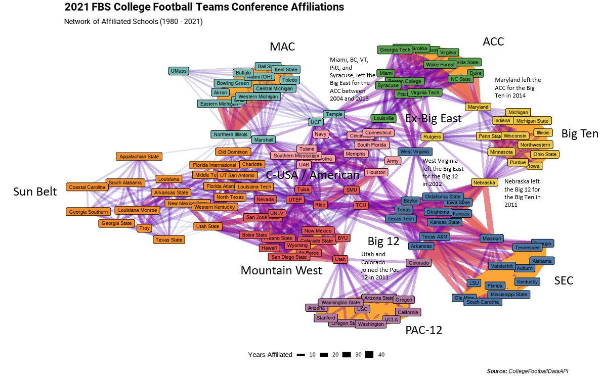

```{r setup, include=FALSE}
knitr::opts_chunk$set(echo = TRUE, warning = FALSE, message = FALSE, error = FALSE)
library(knitr)
```

In my previous [post](https://jlaw.netlify.app/2021/12/27/exploring-college-football-non-conference-rivalries-with-ggraph/) I looked at College Football Non-Conference games to create a network map overlaid on top of the United States using the {ggraph} package.  In this post I'll be extending that to examine Conference Realignment, which is when colleges change from one conference to the next.  Over the years, this has been reactions to internal politics between Football schools vs. Basketball schools, or schools wanting increase in clout by joining a more prestigious conferences.

More specifically, I'll be making a network map based on historical conference affiliations to visualize the changes that have occurred due to realignment and then I'll zoom specifically into the case of the Big 12 conference to show how the graph reflects the history of the conference.

Since all of the packages being used in this post were described in the prior post, I'll be skipping through that sections.

# Set up


```{r libraries}
library(tidyverse)
library(cfbfastR)
library(tidygraph)
library(ggraph)
library(ggtext)
library(showtext)
library(ggbump)

font_add_google('Roboto', "roboto")
showtext_auto()
```

# Creating a Network of the FBS Conference Affiliations

For this both analyses I'll be creating a network graph where individual schools are the nodes and the edges represent whether those schools were in the same conference in a given year.  Since conference affiliations will change over time, the number of years that school's were in the same conference will form a strength of association.  To get this data, I'll be using the `cfdb_team_info()` function from the {cfbfastR} package to return a list of all the FBS schools and their conference affiliation for each year between 1980 and 2021.  

The choice of 1980 is arbitrary to limit the number of connections and the size of the data.  However, the package can return data at least as far back as 1900.

In order to extract the data for each year I pass a vector of years 1980 through 2021 into `map_dfr` from {purrr} to run a custom function taking each individual year as an input and stacking the results into a single data frame.  My custom function first calls the College Football Database API to retrieve all the schools for a given year and removes all the Independent schools since they do not have an affiliation (for example, Notre Dame).  Then since I need to list my list of schools into a list of co-occurrence for each conference, I `group_by()` conference so the next parts of the function get run on a conference by conference basis, expand the school column to create two columns with all within conference combinations.  Since "all within conference combinations" includes having the same school twice, I'll filter out those rows, and since A/B is different than B/A, I'll create new variables that will always put the school coming first alphabetically into `school1` and the other into `school2`.  Technically, this will double each entry but I'll run `distinct()` to get the unique set since I'm going to eventually weight by the number of years and this function runs one year at a time.

```{r get_data, cache=TRUE}
conference_graph_data <- map_dfr(1980:2021, function(yr){
  # get the list of schools for a given year
  x <- cfbd_team_info(year = yr) %>%
    # remove independents
    filter(conference != 'FBS Independents') %>%
    group_by(conference) %>% 
    # get all combinations of schools within each conference
    expand(school, school, .name_repair = 'universal')%>% 
    # Remove the combinations that are the same school twice
    filter(school...2 != school...3) %>%
    # Enforce an order so that each school pair appears in the same order
    mutate(school1 = if_else(school...2 < school...3, school...2, school...3),
           school2 = if_else(school...2 < school...3, school...3, school...2),
           season = yr) %>%
    # subset the columns
    select(season, conference, school1, school2) %>%
    # remove duplicates since each combination would be counted twice
    distinct()
  return(x)
  
})
```

For the nodes on this graph I'll only want the schools that are part of the Football Bowl Subdivision in 2021 rather than schools that may have dropped down to the FCS.  To get this list I'll run `cfdb_team_info(year = 2021)` to get a data frame of all 2021 schools.  But since I only need a vector to filter on, I'll use `pull()` to just extract the school name to the vector.

```{r current_schools}
current_fbs <- cfbd_team_info(year = 2021) %>%
  pull(school)

```

Next, I'll use the {tidygraph} package to turn this list of edges into a `tbl_graph()` object.  First I `ungroup` the data frame since it would still be grouped from my custom function.  Then using the `count()` function I create a weight columns for each year the school schools are affiliated with each other.  Next, I leverage the vector I created in the step before to keep only edges where both schools are currently in the FBS.  Then I create the `tbl_graph` object using `as_tbl_graph()`.

`tbl_graph` objects can be manipulated using {dplyr} verbs to create additional information for either the nodes or the edges.  In this instance I add two additional columns to the nodes:

1. I add the number of schools that each node is affiliated with using `centrality_degree()`
2. I create grouping of node communities using `group_louvain()`

```{r build_graph}
conf_graph_all <- conference_graph_data %>% 
  ungroup() %>% 
  count(school1, school2, name = 'weight', sort = T) %>% 
  filter(school1 %in% current_fbs & school2 %in% current_fbs) %>% 
  as_tbl_graph(directed = F) %>%
  mutate(degree = centrality_degree(),
         community = group_louvain())

print(conf_graph_all)

```

Note that in the above output, you can see the columns for `degree` and `community` that I created.  For the Arizona and Arizona State columns, the `degree` means that they are each connected to 11 schools (which I found kind of shocking, but since the Pac-10 formed in 1978 it does make sense that they've only been in a conference with the other now Pac-12 schools).  The `community` column means that they both belong to the same grouping of nodes, which is this case is probably the Pac-12.

For creating the network visualization itself, I'm using the {ggraph} package which has a very similar syntax to {ggplot2}.  The important notes here is that I'm displaying the edges as straight lines using `geom_edge_link()` and varying the shading, color, and width based on the weight.  And I'm displaying the nodes as labels using `geom_node_label` and filling in by the `community` column.  Everything else should be pretty normal if you're familiar with {ggplot2} syntax.

```{r eval=FALSE}
conf_graph_all %>% 
  ggraph() + 
  geom_edge_link(aes(edge_alpha = weight, edge_color = weight, edge_width = weight)) + 
  geom_node_label(aes(label = name, fill = factor(community)), show.legend = F, size = 3) + 
  scale_edge_alpha_continuous(guide = 'none') + 
  scale_edge_width() + 
  scale_edge_color_viridis(option = 'C', end = .8, guide = 'none') + 
  scale_size_discrete(range = c(4, 6)) + 
  ggthemes::scale_fill_gdocs(guide = F, palette = ggthemes::tableau_color_pal()) + 
  labs(title = "2021 FBS College Football Teams Conference Affiliations",
       subtitle = "Network of Affiliated Schools (1980 - 2021)",
       edge_width = "Years Affiliated",
       caption = '**Source:** CollegeFootballData API') + 
  theme_graph() + 
  theme(
    legend.position = 'bottom',
    plot.title = element_markdown(family = 'roboto'),
    plot.subtitle = element_markdown(family = 'roboto'),
    plot.caption = element_markdown()
  )
```



While I normally like to have everything be reproducible it felt easier to do some annotations about what the various communities are and how they reflect the current conference structure as well as how schools that change conferences do appear as caught in a tug of war between two communities.  The piece that I enjoy the most is the depiction of the former Big East football teams with Syracuse, Virginia Tech, Miami, Pittsburgh, and Boston College being teams that left for the ACC between 2004 and 2013 (with Louisville following in 2014); West Virginia which left for the Big 12 in 2012, and Rutgers which left for the Big Ten in 2014 (along with Maryland who left the ACC for the Big Ten and shows up very clearly between those two clusters).

# Zooming into the Big 12 

Using a similar technique to the one above I can look at a sub-graph of the current Big 12 schools as well as all the schools that are one degree removed from a current Big 12 school.

Similar to before, I'll query the College Football Data Base API and pass in the parameter B12 for the Big 12 Conference and the year 2021 to get the list of existing schools and then I'll use that list to filter to the current Big 12 schools and any other schools that has ever been affiliated with a current Big 12 school and using community detection with `group_louvain()`.

```{r b12}
current_big_12 <- cfbd_team_info(conference = 'B12', year = 2021) %>%
  pull(school)


conf_graph_b12 <- conference_graph_data %>% 
  ungroup() %>% 
  # Filter to only pairs that involve at least 1 Big 12 School
  filter(school1 %in% current_big_12 | school2 %in% current_big_12) %>% 
  # Count the pairs to form the number of years that they were affiliated
  count(school1, school2, name = 'weight', sort = T) %>% 
  # Turn to tbl_graph_object
  as_tbl_graph(directed = F) %>%
  # Create indicator for a current Big 12 Schools
  mutate(is_current_big_12 = name %in% current_big_12,
         name = if_else(is_current_big_12, paste0("**",name,"**"), name),
         community = group_louvain()) 

```

Then using similar code to the full network above, I can plot the Big 12 sub-graph.  The current Big 12 school's names will be starred:

```{r b12_chart, out.width="100%"}
conf_graph_b12 %>%
ggraph() + 
  geom_edge_link(aes(edge_alpha = weight, edge_color = weight, edge_width = weight)) + 
  geom_node_label(aes(label = name, fill = factor(community), 
                      size = is_current_big_12), show.legend = F,
                  alpha = .5) + 
  scale_edge_alpha_continuous(guide = 'none') + 
  scale_edge_width() + 
  scale_edge_color_viridis(option = 'C', end = .8, guide = 'none') + 
  scale_size_discrete(range = c(3.5, 4.5)) + 
  scale_fill_discrete(guide = F) + 
  labs(title = "2021 Big 12 Football Conference Network",
       subtitle = "Tracking Former Conference Members of Current Big 12 Schools (1980 - 2021)",
       edge_width = "Years Affiliated",
       caption = '**Source:** CollegeFootballData API') + 
  theme_graph() + 
  theme(
    legend.position = 'bottom',
    plot.title = element_markdown(family = 'roboto'),
    plot.subtitle = element_markdown(family = 'roboto'),
    plot.caption = element_markdown()
    
  )

```
I like the [Big 12](https://en.wikipedia.org/wiki/Big_12_Conference#Former_members) as an example because its the Conference that reveals the most history in its structure forming in 1996 from the merging of the [Big 8](https://en.wikipedia.org/wiki/Big_Eight_Conference#Conference_split) (Missouri, Colorado, Nebraska, Oklahoma, Oklahoma State, Iowas State, Kansas, Kansas State) with four teams from the [Southwest Conference](https://en.wikipedia.org/wiki/Southwest_Conference#Football) (Texas, Texas Tech, Baylor, Texas A&M).  Missouri, Nebraska, and Colorado left for other conferences in 2011 and 2012 creating their sub-cluster, but the strong core network of the other five schools from the Big 8 remain as well as the closer positioning of the four Southwest Conference schools that joined.  Texas A&M left for the SEC in 2012 but shows up as less of an outlier given their time with the other Texas schools in the Southwest Conference for the 16 years in this data before the conference dissolved and having been in the Big 12 for 6 years before leaving.

The schools from the Southwest Conference that weren't absorbed into the Big 12 went their separate ways.  Arkansas joined the SEC.  Rice, TCU, and SMU joined the Western Athletic Conference (WAC), and Houston joined Conference USA.

The red and blue clusters are easily explained and lack much of the history that goes with the green cluster.  TCU moved its way from the WAC to Conference USA in 2001 then onto the Mountain West Conference in 2005 before joining the Big 12 in 2012.  In its journey TCU became associated with 21 schools that are only on the chart because of them.

The blue cluster, West Virginia, is connected to its former conference-mates in the Big East conference before joining the Big 12 in 2012.  Cincinnati, Louisville, and South Florida appear between TCU and West Virginia due to their being in Conference USA before joining the Big East.

The most interesting part is the green grouping and how you can see some sub-grouping that are in line with historical conference realignment:
1. The core group of the Big 8 that have stayed together (Kansas, Kansas State, Oklahoma, Oklahoma State, Iowa State)
2. The piece of the Big 8 that left the Big 12 (Missouri, Nebraska, Colorado)
3. The piece of the Southwest Conference that joined the Big 12 (Texas, Texas Tech, Texas A&M, Baylor)
4. The piece of the Southwest Conference that left to join other Conferences (Arkansas, Rice, SMU, Houston, TCU)

This was a lot of narrative, so hopefully this image can show the migration and overlap between these 50 schools a bit better.  For the non-current Big 12 schools, the chart reflects the time when they were associated.  For example, a school like Wyoming shows a gap for the time when TCU was in Conference USA between its time in the WAC and the Mountain West since for that short period they were not in a conference with any current Big 12 school.

```{r school_migration, out.width="100%"}
conference_graph_data %>%
  ungroup() %>%
  filter(school1 %in% current_big_12 | school2 %in% current_big_12) %>%
  gather(dummy, school, -season, -conference) %>% 
  select(-dummy) %>%
  distinct() %>% 
  add_count(school, name = 'years') %>%
  mutate(school = if_else(school %in% current_big_12, paste0("**",school,"**"), school)) %>%
  group_by(school, years, conference) %>% 
  summarize(start = min(season)-.5, end = max(season)+.5) %>%
  mutate(first_conference = max(if_else(start == min(start), conference, NA_character_), na.rm = T),
         first_start = max(if_else(start == min(start), start, NA_real_), na.rm = T),
         n_conferences = n_distinct(conference)) %>%
  arrange(first_start, first_conference, -years, n_conferences, school) %>% 
  ungroup() %>% 
  mutate(ord = row_number()) %>% 
  ggplot(aes(x = fct_reorder(school, ord, min, .desc = T))) + 
  geom_linerange(aes(ymin = start, ymax = end, color = conference), size = 3) + 
  labs(x = "Schools", y = "Season", color = "Conference",
       title = "The 2021 Big 12 Schools and Prior Affiliates (1980-2021)",
       subtitle = "Current Big 12 schools are **bolded**") + 
  coord_flip() + 
  ggthemes::scale_color_tableau() + 
  cowplot::theme_cowplot() + 
  theme(
    axis.text.y = element_markdown(),
    plot.subtitle = element_markdown(),
    panel.grid.major.y = element_line(color = 'grey90')
  )

```


