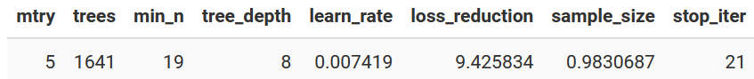

```{r setup, include=FALSE}
knitr::opts_chunk$set(echo = TRUE, warning = FALSE, message = FALSE, error = FALSE)
library(knitr)
```

In this fourth (and hopefully final) entry in my "Icing the Kicker" series of posts, I'm going to jump back to the [first post](https://jlaw.netlify.app/2022/01/24/predicting-when-kickers-get-iced-with-tidymodels/) where I used `tidymodels` to predict whether or not a kick attempt would be iced.  However, this time I see if using the `h2o` AutoML feature and the `SuperLearner` package can improve the predictive performance of my initial model.

### Why is this ML for the Lazy?

I called this ML for the Lazy because for h2o and SuperLearner models I'm going to do absolutely nothing but let the algorithms run.  No tuning, no nothing.

### The Data

The data for this exercise was initially described in the [first](https://jlaw.netlify.app/2022/01/24/predicting-when-kickers-get-iced-with-tidymodels/) post in the series.  During this post I will construct three models:

1. Replicating the final model from the original [post](https://jlaw.netlify.app/2022/01/24/predicting-when-kickers-get-iced-with-tidymodels/) using `tidymodels`
2. A version using `h2o`'s [autoML](https://docs.h2o.ai/h2o/latest-stable/h2o-docs/automl.html) function
3. A version using the [`SuperLearner`](https://github.com/ecpolley/SuperLearner) package for ensembles


```{r libraries}
library(tidyverse) #Data Manipulation
library(tidymodels) # Data Splitting and Replicating Initial Model
library(themis) # For SMOTE Recipie
library(h2o) # For AutoML
library(SuperLearner) # For SuperLearner Ensemble.
library(here) # For path simplification
```

I'll read in the data from the first post.  This code block should look familiar from the other three posts in the series.

```{r readIn}
fg_data <- readRDS(here('content/post/2022-01-17-predicting-when-kickers-get-iced-with-tidymodels/data/fg_attempts.RDS')) %>%
  transmute(
    regulation_time_remaining,
    attempted_distance,
    drive_is_home_offense = if_else(drive_is_home_offense, 1, 0),
    score_diff,
    prior_miss = if_else(prior_miss==1, 'yes', 'no'),
    offense_win_prob,
    is_overtime = if_else(period > 4, 1, 0),
    is_iced = factor(is_iced, levels = c(1, 0), labels = c('iced', 'not_iced'))
  )
```

The next step is to replicate how the data was divided in the training and testing sets from the initial post.  This is done using the `initial_split()` function from `rsample`.  The seed will be set to what it originally was so that the same training and testing splits are used.

```{r split}
set.seed(20220102)
ice_split <- initial_split(fg_data, strata = is_iced)
ice_train <- training(ice_split)
ice_test <- testing(ice_split)
```

### Model #1: TidyModels

To replicate the results from `tidymodels` I will first reconstruct the pre-processing recipe that used one-hot encoding to turn categorical variables into numeric and applied the SMOTE algorithm to deal with the severe class imbalance in the data.

```{r recipie}
rec_smote <- recipe(is_iced ~ ., data = ice_train) %>%
  step_dummy(all_nominal_predictors(), one_hot = T) %>%
  step_smote(is_iced) 
```


In that post the final model was a tuned XGBoost model with the following parameters:


So rather than set up a tuning grid, I'll just build a spec that includes that exact parameters and combine it with the recipe in a workflow:

```{r specs}
orig_wf <- workflow(rec_smote,
               boost_tree(
                 "classification",
                 mtry = 5,
                 trees = 1641,
                 min_n = 19,
                 tree_depth = 8,
                 learn_rate = 0.007419,
                 loss_reduction = 9.425834,
                 sample_size = 0.9830687,
                 stop_iter = 21
               )) 

```

Next step is to run the model on the full training data and predict on the testing data using the `last_fit()` function.  I will have the function returns testing set metrics for Precision, Recall, and F1 Score.

```{r fit, cache=TRUE}
orig_results <- last_fit(orig_wf, 
                         ice_split, 
                         metrics=metric_set(f_meas, precision, recall))
```

The performance metrics can be extracted using the `collect_metrics()` function and then I'll do some post-processing to put it in a format that will eventually be combined with the other models:

```{r orig_metrics}
orig_metrics <- collect_metrics(orig_results) %>% 
  transmute(
    label = "Original Model",
    metric = .metric,
    estimate = .estimate
  )

kable(orig_metrics)
```

And the `collection_predictions()` function will extract the predictions for the test set to use in a confusion matrix:

```{r orig_cf}
orig_cf <- collect_predictions(orig_results) %>%
  count(is_iced, .pred_class) %>% 
  mutate(label = "Original Model", .before = 1) %>% 
  rename(pred = .pred_class)

```

### Model #2 - h2o AutoML

The next candidate will be h2o's AutoML function.  h2O is an open-source machine learning platform that runs in java and has interfaces with R amongst others.  The AutoML feature will auto-magically try different models and eventually construct a leaderboard of the best models.  For this section, the blog post from [Riley King](https://rileyking.netlify.app/post/could-automl-win-in-the-sliced-data-science-competition/) was an inspiration as AutoML was used to compare against data from the Sliced data science competition.

In order to start using h2o I must first initialize the engine:
```{r h2o_start, results='hide'}
h2o.init()
```

h2O also has its own data format which must used.  Fortunately its easy to convert between the tibbles and this format with `as.h2o`:

```{r h2o_format, results='hide'}
train_data <- as.h2o(ice_train)
```

Due to how h2o is set up, I'll need to specific the name of the dependent variable (y) as a string and provide the list of predictors as a vector of strings (x).  This is most easily done prior to the function call using `setdiff()` to remove the dependent from the other variables.

```{r h2o_parameters}
y <- "is_iced"
x <- setdiff(names(train_data), y)
```

Now its time to run the AutoML function.  In the `h2o.automl()` function I provide the name of the dependent variable, the vector of the independent variable, a project name which I believe doesn't matter for this purpose, a boolean to tell it to try to balance classes, and a seed so that results are replicable.  The final parameter I give the function is the "max_runtime_secs".  Since the algorithm will continue to spawn new models it needs a criteria to know when to stop.  For convenience, I will allow it to run for 10 minutes.

```{r autoML, cache=TRUE,results='hide'}
h2oAML <- h2o.automl(
  y = y,
  x = x,
  training_frame = train_data,
  project_name = "ice_the_kicker_bakeoff",
  balance_classes = T,
  max_runtime_secs = 600,
  seed = 20220425
)
```
When the AutoML algorithm completes each model that was run will be placed in a leaderboard which can be accessed by:

```{r h2o_leaderboard}
leaderboard_tbl <- h2oAML@leaderboard %>% as_tibble()

leaderboard_tbl %>% head() %>% kable()

```

I can get the top model from the leaderboard by running `h2o.getModel()` on the model id from the leaderboard. In this case it was a Gradient Boosted Machine (GMB).

```{r topModelId}
model_names <- leaderboard_tbl$model_id
top_model <- h2o.getModel(model_names[1])
```

With the model id I can also see what the parameters are that were used in this model.

```{r topModel}
top_model@model$model_summary %>% 
  pivot_longer(cols = everything(),
               names_to = "Parameter", values_to = "Value") %>% 
  kable(align = 'c')
```

While for `tidymodels` the `last_fit()` function ran the model on the test set for me, for h2o I'll need to do that myself... but its not that difficult.  h2o has an `h2o.predict()` function similar to R's `predict()` which takes in a model and data to predict on through a *newdata* parameter.  For that *newdata* I need to convert the test data into the h2o format through `as.h2o()`.  Then I bind the predictions as a new column into the rest of the test data so that performance statistics and confusion metrics can be generated.

```{r h2o_predict, results='hide'}
h2o_predictions <- h2o.predict(top_model, newdata = as.h2o(ice_test)) %>%
  as_tibble() %>%
  bind_cols(ice_test)
```

Similar to how I needed to do the predictions manually, I'll also need to collect the performance metrics manually.  This is also easy using the `yardstick` package:

```{r h2o_perf_metrics}
h2o_metrics <- bind_rows(
  #Calculate Performance Metrics
  yardstick::f_meas(h2o_predictions, is_iced, predict),
  yardstick::precision(h2o_predictions, is_iced, predict),
  yardstick::recall(h2o_predictions, is_iced, predict)
) %>%
  # Add an id column and make it the first column
  mutate(label = "h2o", .before = 1) %>% 
  # Remove the periods from column names
  rename_with(~str_remove(.x, '\\.')) %>%
  # Drop the estimator column
  select(-estimator)

kable(h2o_metrics)
```

Finally, I'll compute the confusion matrix.

```{r h2o_cf}
h2o_cf <- h2o_predictions %>% 
  count(is_iced, pred= predict) %>% 
  mutate(label = "h2o", .before = 1)
```

### Model #3: SuperLearner

The third candidate model that I'll try is through the `SuperLearner` package.  `SuperLearner` is an ensemble package that will create many different types of models and then by taking a weighted combination of those models hopes to attain better performance accuracy than any of the individual models along.

To use the `SuperLearner()` function, the dependent variable vector Y must be provide as a numeric vector, and the predictors vector X must also only contain numeric data, therefore all factors are converted back to numeric.

Since I'm predicting a binary outcome (whether or not a kick attempt will be iced) I specify the family as *binomial*.  Finally, the models to be combined as specified in the `SL.library` argument.  The full list of models are contained in the `listWrappers()` function.  However, I'm choosing a subset primarily out of convenience.  Mostly that I couldn't get some of the other models (for example bartMachine) to run properly.  The models I'm choosing to include in the ensemble are a GLM, XGBoost, GLM w/ Interactions, Regularized GLM (glmnet), MARS (earth), GAM, and a Random Forest.

```{r sl_fit, cache=TRUE}
mod <- SuperLearner(
  Y = ice_train %>% mutate(iced = if_else(is_iced == 'iced', 1, 0)) %>% 
    pull(iced),
  X = ice_train %>% mutate(prior_miss = if_else(prior_miss == 'yes', 1, 0)) %>% 
    select(-is_iced) %>% as.data.frame,
  family = binomial(),
  SL.library = c( 'SL.glm', "SL.xgboost", "SL.glm.interaction", 'SL.glmnet', 
                  'SL.earth', 'SL.gam', 'SL.randomForest')
)
```

Since the ultimate output of the SuperLearner is a weighted combination of those models I can extract the weights and show which models have the highest influence on the final predictions.

```{r plot_weights, out.width="100%"}
mod$coef %>% as_tibble(rownames = "model") %>% 
  mutate(model = str_remove_all(model, '(SL\\.)|(_All)')) %>%
  ggplot(aes(x = fct_reorder(model, -value), y = value, fill = model)) + 
    geom_col() + 
    geom_text(aes(label = value %>% percent), vjust = 0) + 
    scale_fill_viridis_d(option = "B", end = .8, guide = 'none') + 
    labs(x = "Model", y = "% Contribution of Model", title = "% Contribution For Each Component to SuperLearner") + 
    cowplot::theme_cowplot() + 
    theme(
      axis.text.y = element_blank(),
      axis.ticks.y = element_blank()
    )

```

It appears that Random Forest has the strongest effect followed by the MARS model and the XGBoost model.

Predicting the test set is similar to the h2o version except I can use the generic predict function.  However, the predict function will return a vector of probabilities of being iced rather than a label like h2o did.  Therefore I need to make a judgement call on a probability cut-off for determining an attempt as iced or not.  I'll choose to use the incidence rate of the training data, 4.2%, as the cut-off.  Probabilities greater than 4.2% will be considered "iced" and below that will be "not iced".

```{r sl_predict}
pred_sl = predict(mod, newdata = ice_test %>% 
                    mutate(prior_miss = if_else(prior_miss == 'yes', 1, 0)) %>%
                    select(-is_iced) %>% 
                    as.data.frame, type = 'response')$pred 

pred_sl <- ice_test %>%
  mutate(pred = if_else(pred_sl >= mean(ice_train$is_iced == 'iced'), 1, 0),
         pred = factor(pred, levels = c(1, 0), labels = c('iced', 'not_iced')))
```

Similar to the above section, I'll use `yardstick` for the performance metrics.
```{r sl_perf}
sl_metrics <- bind_rows(
  yardstick::f_meas(pred_sl, is_iced, pred),
  yardstick::precision(pred_sl, is_iced, pred),
  yardstick::recall(pred_sl, is_iced, pred)
) %>% 
  mutate(label = "SuperLearner", .before = 1) %>% 
  rename_with(~str_remove(.x, '\\.')) %>% 
  select(-estimator)

kable(sl_metrics)

```


And calculate the confusion matrix.
```{r sl_cf}
sl_cf <- pred_sl %>% 
  count(is_iced, pred) %>% 
  mutate(label = "SuperLearner", .before = 1)

```


### Comparing the Three Models
For each of the three models I've calculated Precision, Recall, and F1.  I'll combine this information in a plot so its easier to see the different performance for each model:

```{r combined_perf, out.width="100%"}
bind_rows(
  orig_metrics,
  h2o_metrics,
  sl_metrics
) %>% 
  ggplot(aes(x = str_wrap(label, 9), y = estimate, fill = label)) + 
    geom_col() + 
    geom_text(aes(label = estimate %>% percent), vjust = 1, color = 'grey90') + 
    scale_fill_viridis_d(option = "C", end = .6, guide = 'none') + 
    facet_wrap(~metric, nrow = 1, scales = "free_y") +
    labs(x = "Model", y = "Performance Metric",
         title = "Comparing the Performance Metrics on Test Set") + 
    theme_light() + 
    theme(
      axis.text.y = element_blank(),
      axis.ticks.y = element_blank(),
      strip.text = element_text(color = 'black')
    )

```
From the perspective of the F1-Score which balances precision and recall the original model performed the best.  But looking at the components it appears that the original model had a higher precision meaning that when it predicted an iced attempt it was more likely to be right than the other models (although was still only right 35% of the time).  However, it left some true iced attempts on the table since its recall was substantially lower than both the h2o model and the SuperLearner model.

I can get a better lens on what things are and are not being predicted well by looking at each model's confusion matrix on the test set.

```{r combined_cf, out.width="100%"}
bind_rows(
  orig_cf,
  h2o_cf,
  sl_cf
) %>% 
  group_by(label) %>% 
  mutate(pct = n/sum(n)) %>% 
  ggplot(aes(x = is_iced, y = pred, fill = n)) + 
    geom_tile() + 
    geom_text(aes(label = glue::glue('{n}\n({pct %>% percent})')),
              color = 'grey90') + 
    facet_wrap(~label, nrow = 1) + 
    scale_fill_viridis_c(guide = 'none', end = .8) + 
    labs(x = "Actual Value", y = "Predicted Value",
         title = "Comparing Confusion Matrices") + 
    theme_light() + 
    theme(
      axis.ticks = element_blank(),
      strip.text = element_text(color = 'black')
    )
```

In the confusion matrix its much easier to see that the original model was less likely to make a prediction of iced than the other two models.  This led to it having the higher precision but also the lower recall as the original model missed 85 iced attempts vs. the h2o model only missing 33 and the SuperLearner only missing 24.

So which model performed the best?  If I'm just going by balanced performance by looking at the F1 score then the original model outperformed the other two.  However, its worth thinking about whether precision or recall is more important since that could have an influence on how to view the model's performance.  If ensuring that all the iced kicked are captured is most important then I should weight more towards recall.  But if I want to feel that when the model predicts an iced kick that there will be an iced kick I should stick with the original model.

### Other Posts in the Icing the Kicker Series

* Part I: [Predicting When Kickers Get Iced with {tidymodels}](https://jlaw.netlify.app/2022/01/24/predicting-when-kickers-get-iced-with-tidymodels/)
* Part II: [Does Icing the Kicker Really Work? A Causal Inference Exercise](https://jlaw.netlify.app/2022/02/14/does-icing-the-kicker-really-work/)
* Part III: [Ain't Nothin But A G-Computation (and TMLE) Thang: Exploring Two More Causal Inference Methods](https://jlaw.netlify.app/2022/03/13/ain-t-nothin-but-a-g-computation-and-tmle-thang-exploring-two-more-causal-inference-methods/)

