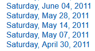

```{r setup, include=FALSE}
knitr::opts_chunk$set(echo = TRUE, warning = FALSE, message = FALSE, error = FALSE, out.width = "100%")
library(knitr)
options(scipen=999)
```

In my [prior post](https://jlaw.netlify.app/2022/07/13/how-much-has-covid-cost-the-nyc-subway-system-in-lost-fares/) I used forecasting to look at the effect of COVID from an expected amount of New York City subway swipes.  In this post I will drill a level deeper to run forecasts for various types of subway cards to see if any particularly type has recovered better or worse than any others.

The goal for this post will be to create a top-level forecast for total NYC subway fares and forecasts for each of the types of subway cards.  The sub-levels of individual subway cards form a natural hierarchy with the total number and my forecast, I'd like the forecasts for the sub-levels and for the total to match each other for the sake of consistency.  This is called "hierarhical forecasting".  More details can be found in Rob Hyndman and George Athanasopoulos' [Forecasting: Principles and Practice](https://otexts.com/fpp3/hierarchical.html).

The book makes use of the `fable` and `tsibble` packages and I will use those here are well.

## Libraries

```{r libraries}
library(tsibble) # Data Structure for Time Series
library(tidyverse) # Data Manipulation Packages
library(fable) # Time Series Forecasting Models
library(lubridate) # Date Manipulation
library(scales) # Convenience Functions for Percents
```

```{r echo=FALSE}
library(here)
```

## Data Preparation

The data set will be the same as from the [prior blog post](https://jlaw.netlify.app/2022/07/13/how-much-has-covid-cost-the-nyc-subway-system-in-lost-fares/) which contains weekly Subway data by station, card type, and week from May 2010 through June 2022.  Please see the [previous post](https://jlaw.netlify.app/2022/07/13/how-much-has-covid-cost-the-nyc-subway-system-in-lost-fares/) for more details on the data processing.  The raw fare files come from the [MTA's Website](http://web.mta.info/developers/fare.html).

```{r readDT}
dt <- readRDS(here('content/post/2022-07-13-how-much-has-covid-cost-the-nyc-subway-system-in-lost-fares/data/mta_data.rds'))
```

In the data set there are 30 different fare types, however, I really don't want to create 30 different forecasts.  Especially if some of these are going to be small.  The top 5 fare types make up 93% of the fares, so I'll aggregate the data set to the week and fare_type level and add up the fares column which represents the number of swipes on each card.

```{r aggregate}
dt_by_fare <- dt %>%
  #Remove Out of Pattern Thursday File
  filter(week_start != '2010-12-30') %>%
  #Clean Up fare types and create date fields
  mutate(
    week_start = ymd(week_start),
    year_week = yearweek(week_start),
    fare_type = case_when(
      fare_type == 'ff' ~ 'full_fare',
      fare_type == 'x30_d_unl' ~ 'monthly_unlimited',
      fare_type == 'x7_d_unl' ~ 'weekly_unlimited',
      fare_type == 'students' ~ 'student',
      fare_type == 'sen_dis' ~ 'seniors',
      TRUE ~ 'other'
    )
  ) %>% 
  group_by(week_start, year_week, key,  fare_type) %>% 
  # Drop all the groupings during summary
  summarize(fares = sum(fares),  .groups = 'drop')
```

Now the data set has gone from `r nrow(dt) %>% comma` rows to `r nrow(dt_by_fare) %>% comma`.

To be able to use the `fable` package to do forecasting, the data needs to be in the `tsibble` format.  This construction takes a "key" and an "index" parameter.  The "key" is the grouping factor which in this case is the *fare_type* and the "index" is the time parameter which will be the *year_week* field.

Then to create the "hierarchical" structure into the data, the `aggregate_key` function from `fabletools` is used.  Telling the structure to be aggregated over the fare_types by adding up the fares will allow for forecasting reconciliation to ensure that the forecast outputs are coherent.

```{r tsibble}
dt_ts <- tsibble(dt_by_fare, key = fare_type, index = year_week) %>% 
  aggregate_key(fare_type, fares = sum(fares))
```

The `dt_ts` data set is now 628 rows greater than the `dt_by_fare` data set.  This is because of the aggregated layer that was generated from `aggregate_key()`.  The 628 is the number of distinct weeks in the data.

If continuing down the forecasting path there were eventually be an error during the forecast step due to a missing value in the initial time series.  The `scan_gaps()` function from `tsibble` will look for implicit missing observations (gaps in the index).  The `count_gaps()` function will also provide a similar summary.

```{r gaps}
scan_gaps(dt_ts) %>% 
  count(year_week) %>%
  kable()
```

The function shows that I'm missing the data for the 18th week of 2011 and the 16th week at 2013.  At first I thought this was a problem with my data processing from before.  But when visiting the [MTA website](http://web.mta.info/developers/fare.html) those files are actually missing.



Notice that the file for May 21st, 2011 is not listed.  Same with May 4th, 2013.

To get around this issue, I need to first turn the implicit missings into explicit NAs.  This can be done with `tsibble`'s `fill_gaps()` function which adds in *NA*s for the missing dates.

```{r fillgaps}
dt_ts <- dt_ts  %>% 
  group_by_key() %>% 
  fill_gaps()


dt_ts %>% 
  head() %>% 
  kable()
```
Notice that the two missing dates now appear.  However, the forecasting is also going to have problems with the *NA* values.  So I'll need to fill in a value.  For simplicity, I'm going to use `tidyr`'s `fill` function and just use the previous value. 

```{r fillldown}
dt_ts <- dt_ts %>% 
  arrange(year_week) %>% 
  fill(fares, .direction = 'down')

dt_ts %>% 
  filter(year_week %in% c(yearweek('2011 W17'), 
                          yearweek('2011 W18'), 
                          yearweek('2011 W19')
                          ),
         fare_type == 'full_fare'
           ) %>% 
  arrange(fare_type) %>% 
  kable()
```


## Forecasting

The objective of this post is to determine which types of Subway fares have been most affected by COVID.  In order to do this I'll consider the time between 2010-2019 to be the pre-COVID period which the forecasting model will be built and then I'll forecast 2020 - June 2022 and compare to the actuals.


```{r model_fit}
fit <- dt_ts %>% #dt_filled %>%
  filter(year(year_week)< 2020) %>%
  model(base = ARIMA(fares))%>%
  reconcile(bottom_up = bottom_up(base),
            top_down = top_down(base),
            min_trace = min_trace(base, "mint_shrink"))
```

```{r forecasting}
fc <- fit %>% 
  forecast(new_data = dt_ts %>% filter(year(year_week) >= '2020')) 

```

```{r visual}
autoplot(fc, dt_ts, level = NULL) + 
  facet_wrap(~fare_type, scales = "free_y") + 
  scale_y_continuous(labels = scales::comma_format())
```

```{r checking_reconciliation}
fc %>% filter(year_week == yearweek('2020 W01')) %>%
  as_tibble() %>% 
  transmute(fare_type = if_else(
    is_aggregated(fare_type), 'aggregated', as.character(fare_type)),
    year_week, model = .model, forecast = .mean) %>% 
  spread(model, forecast) %>% 
  group_by(is_aggregated = ifelse(fare_type == 'aggregated', 'Top-Level', 'Sum of Components')) %>% 
  summarize(across(where(is.numeric), sum)) %>% 
  gather(model, value, -is_aggregated) %>% 
  ggplot(aes(x = model, y = value, fill = is_aggregated)) + 
    geom_col(position = 'dodge') + 
    geom_text(aes(label = paste0(round(value/1e6, 1), "MM")), vjust = 0,
              position = position_dodge(width = 1)) +
    coord_cartesian(ylim = c(30e6, 30.6e6)) + 
    scale_y_continuous(labels = function(x){paste0(x/1e6, "MM")}) + 
    scale_fill_viridis_d(option = "C", begin = .2, end = .8) + 
    labs(title = "Comparing Different Reconciliation Methods",
         subtitle = "Week 1 2020",
         caption = 'NOTE: y-axis does NOT start at 0',
         x = "Reconcilation Method", y = "Total # of Fares",
         fill = "") + 
    cowplot::theme_cowplot() + 
    theme(
      axis.text.y = element_blank(),
      axis.ticks.y = element_blank(),
      axis.line.y = element_blank(),
      legend.position = 'bottom',
      legend.direction = 'horizontal'
    )
```


```{r recovery}
bind_rows(
  dt_ts %>% 
    filter(year_week == max(year_week)) %>% 
    as_tibble() %>%
    transmute(fare_type =  if_else(is_aggregated(fare_type), 
                                   'All Fares', 
                                   as.character(fare_type)), 
              time = "actuals", 
              fares),
  fc %>% 
    as_tibble() %>% 
    filter(year_week == max(year_week), .model == "min_trace") %>% 
    as_tibble() %>%
    transmute(fare_type =  if_else(is_aggregated(fare_type), 
                                   'All Fares', 
                                   as.character(fare_type)), 
              time = 'projected', 
              fares = .mean)
) %>% 
  spread(time, fares) %>% 
  mutate(recovery = actuals / projected) %>% 
  gather(period, fares, -fare_type, -recovery) %>%
  ggplot(aes(x = fct_reorder(fare_type, -fares), y = fares, fill = fct_rev(period))) + 
    geom_col(position = 'dodge') + 
    geom_text(aes(label = paste0(round(fares/1e6, 1), "MM")), vjust = 0,
              position = position_dodge(width = .9)) + 
    stat_summary(
      aes(x = fare_type, y = fares),
      geom = 'label',
      inherit.aes = F,
      fontface = 'bold', fill = 'lightgrey',
      fun.data = function(x){
        return(data.frame(y = max(x)+3e6,
                          label = paste0((min(x)/max(x)) %>% percent,
                          " Recovered")))
      }
    )  + 
    labs(title = "Actuals vs. Projected Subway Fares",
         subtitle = "% Recovered is difference between Actual and Projected",
         caption = "Comparing W24 2022 Data",
         x = "",
         y = "# of Fares",
         fill = "") + 
    scale_fill_viridis_d(option = "C", begin = .2, end = .8) + 
    #This link was dope https://stackoverflow.com/questions/22945651/remove-space-between-plotted-data-and-the-axes
    scale_y_continuous(expand = expansion(mult = c(0, .05))) + 
    cowplot::theme_cowplot() + 
    theme(
      legend.position = 'bottom',
      legend.direction = 'horizontal',
      axis.text.y = element_blank(),
      axis.ticks.y = element_blank(),
      axis.line.y = element_blank()
    )


```

```{r}
####Appendix: Forecast Accuarcy
fc %>%
  accuracy(
    data = dt_ts,
    measures = list(rmse = RMSE, mase = MASE, mape = MAPE)
  ) %>%
  arrange(mape)
```

