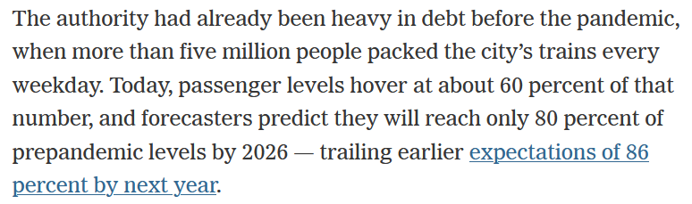

```{r setup, include=FALSE}
knitr::opts_chunk$set(echo = TRUE, warning = FALSE, message = FALSE, error = FALSE)
library(knitr)
options(scipen=999)
```

While writing my posts about COVID's effect on NYC Subway ridership the New York Times published an article called [*The Pandemic Wasn’t Supposed to Hurt New York Transit This Much*](https://www.nytimes.com/2022/08/15/nyregion/mta-nyc-budget.html).  The article states:



I believe the 80% target by 2026 comes from a McKinsey study.  While I don't know the details of the study I do have some subway fare data sitting around.  So why not compare the article's data to my own.

The methodology will be similar to what I did in my [initial subway forecasting post](https://jlaw.netlify.app/2022/07/13/how-much-has-covid-cost-the-nyc-subway-system-in-lost-fares/) using the `modeltime` package and the champion model Prophet w/ XGBoosted Errors to do the forecasting.

## Libraries
```{r libaries}
### Data Manipulation Packages
library(timetk) # For time series features in recipe
library(tidyverse) # General Data Manipulation
library(scales) # Making prettier scales
library(lubridate) # Dealing with Dates

# Modeling Ecosystem
library(modeltime) # Framework for Time Series models
library(tidymodels) # Framework for general recipe and workflows

### Model Packages
library(prophet) # Algorithm for forecasting

```

```{r echo=FALSE}
library(here)
```

## Data

The data is the same as from my [initial post](https://jlaw.netlify.app/2022/07/13/how-much-has-covid-cost-the-nyc-subway-system-in-lost-fares/).  Its initially at the week/station/fare level.  For this exercise I just need the data at the weekly level.

```{r}
fares <- readRDS(file.path(here(), 'content', 'post', 
                           '2022-07-13-how-much-has-covid-cost-the-nyc-subway-system-in-lost-fares', 
                           'data',
                           'mta_data.RDS')) %>% 
  group_by(week_start) %>% 
  summarize(fares = sum(fares))
```

My [first blog post](https://jlaw.netlify.app/2022/07/13/how-much-has-covid-cost-the-nyc-subway-system-in-lost-fares/) in this series covered the `modeltime` package in more detail for trying out many different forecasting models.  That post found that Prophet with XGBoosted Errors was the best model.  Here I'll be replicating that workflow for that model type.

**Step 1: Defining the pre-processing recipe**

This step defines the forecasting formula as predicting fares based on all other features. Then it creates a bunch of time series specific features from the date field in `step_timeseries_signature`.  `step_rm` removes some variables created in the prior step that aren't useful, and finally `step_dummy` turns all the categorical variables into one-hot encoded indicators.  Here I also set the training data set as the MTA Fares beginning during the COVID period (after April 1, 2020) since training on the prior time period will give very strange results.

```{r}
rec <- recipe(fares ~ ., data = fares %>% filter(week_start >= ymd(20200401))) %>%
  step_timeseries_signature(week_start) %>% 
  step_rm(matches("(.iso$)|(am.pm$)|(.xts$)|(hour)|(minute)|(second)|(wday)")) %>% 
  step_dummy(all_nominal(), one_hot = TRUE)
```

**Step 2: Define the Model Workflow and Fit the Model**

Sticking with the `tidymodels` framework, here I define a workflow which will consist of the recipe created in **Step 1** through `add_recipe` and the model set through `add_model()`.  Within `add_model()` the model type is set to Boosted Prophet.  I believe the 'prophet_xgboost' is the default engine so `set_engine` isn't necessary, but good to keep around anyway.

```{r}
prophet_boost_wf <- workflow() %>%
  add_model(
    prophet_boost(seasonality_yearly = TRUE) %>%
      set_engine('prophet_xgboost')
  ) %>% 
  add_recipe(rec) %>%
  fit(fares %>% filter(week_start >= ymd(20200401)) )
```


**Step 3: Using the Model to Forecast the Future**

In this instance I don't have a test set to work with so I'm jumping directly into forecasting.  Also since I don't know how long it will take for the forecast to recover to pre-COVID levels, I'll set the forecast horizon for 6 years in the `h` parameter. Passing in the actual_data let it be included in the output data set.

```{r}
final_fcst <- modeltime_table(
    prophet_boost_wf
  ) %>% 
  modeltime_forecast(
    h = "6 years",
    actual_data = fares,
    keep_data = TRUE
  )
```

*Visualizing the Forecast*

The `modeltime` package makes it easy to visualize the data through the `plot_modeltime_forecast` package.  The default is to create a `plot.ly` plot but that can be converted to a `ggplot2` plot by setting `.interactive` to `FALSE`.

```{r}
final_fcst %>% 
  plot_modeltime_forecast(.interactive = F) + 
  scale_y_continuous(labels = comma)
```

## When will Subway fares return to 80% of Pre-COVID? To 100%?

Now we can see how close my forecast is to the New York Times Report.  I don't actually know what the NY Times is considering Pre-COVID levels but for my purposes I'll use the average number of fares in December 2019 to be my Pre-COVID. 

```{r}
baseline <- fares %>% 
  filter(month(week_start)==12 & year(week_start) == 2019) %>% 
  summarize(avg_fares = mean(fares)) %>% 
  pull(avg_fares)
```

From the projection plot above its clear that there is a seasonality that peaks in the fall and drops in December through the New Year.  To declare victory at 80% I'm going to require that there are 4 consecutive weeks of fares being above the Pre-COVID baseline.

I'm not sure of a great way to define when is the earliest date of the first run of 4 weeks above a threshold but I'm working it out in three steps:

1. Define an indicator for whether that week is above 80% (`above_80_ind`)
2. Run a counter for each time that the indicator flips from 0 to 1 (`run_id_80`) to get an id for each run
3. For each `run_id_80` get the sum of `above_80_inds` to represent the length of each run (`run_length_80`)

```{r}
rec_pct <- final_fcst %>% 
  filter(week_start >= ymd(20200401)) %>% 
  # Build Recovery Percentage
  mutate(recovery_pct = .value / baseline) %>%
  # Define Runs of when recovery_pct is above .8
  mutate(
    above_80_ind = (recovery_pct > .8),
    above_100_ind = (recovery_pct > 1)
  ) %>% 
  # Define ID for each time we start a run
  mutate(
    run_id_80 = cumsum(if_else(above_80_ind == 1 & lag(above_80_ind) == 0, 
                               1, 0)),
    run_id_100 = cumsum(if_else(above_100_ind == 1 & lag(above_100_ind) == 0, 
                               1, 0))
  ) %>% 
  add_count(run_id_80, wt = above_80_ind, name = "run_length_80") %>%
  add_count(run_id_100, wt = above_100_ind, name = "run_length_100")
```

Now I can plot the recovery percentage by week and show that the first time there are four consecutive weeks above 80% is `r rec_pct[which.max(rec_pct$run_length_80 >= 4), ]$week_start` and the first time there are four consecutive weeks above 100% of the Pre-COVID value is `r rec_pct[which.max(rec_pct$run_length_100 >= 4), ]$week_start`.

```{r}
rec_pct %>% 
  ggplot(aes(x = week_start, y = recovery_pct)) + 
    geom_line(color = "#0039A6") + 
    geom_segment(aes(x = min(week_start), 
                     xend = rec_pct[which.max(rec_pct$run_length_80 >= 4), ]$week_start,
                     y = .8,
                     yend = .8), lty = 2) + 
    geom_segment(aes(x = rec_pct[which.max(rec_pct$run_length_80 >= 4), ]$week_start,
                     xend = rec_pct[which.max(rec_pct$run_length_80 >= 4), ]$week_start,
                     y = 0,
                     yend = .8), lty = 2) + 
    geom_segment(aes(x = min(week_start), 
                     xend = rec_pct[which.max(rec_pct$run_length_100 >= 4), ]$week_start,
                     y = 1,
                     yend = 1), lty = 2) + 
    geom_segment(aes(x = rec_pct[which.max(rec_pct$run_length_100 >= 4), ]$week_start,
                     xend = rec_pct[which.max(rec_pct$run_length_100 >= 4), ]$week_start,
                     y = 0,
                     yend = 1), lty = 2) + 
    scale_x_date(breaks = "1 years",
                 labels = year,
                 expand = c(0, 0)) + 
    scale_y_continuous(labels = percent, expand = c(0, 0),
                       breaks = seq(0, 1.6, .2)) + 
    labs(title = "Projected MTA Recovery vs. Pre-COVID",
         subtitle = "Pre-COVID Baseline from December 2019", 
         x = "Date", y = "% of Dec 2019 Baseline") + 
    cowplot::theme_cowplot()

```
Based on this projection the NY Times article is being slightly pessimistic.  According to the above NYC should reach 80% of Pre-COVID baseline by Mid-2025 which is earlier than the article's projection of 2026.

Who will be right?  We'll have to wait at least 3 years to find out!