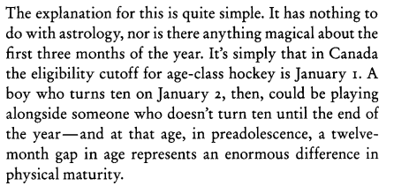
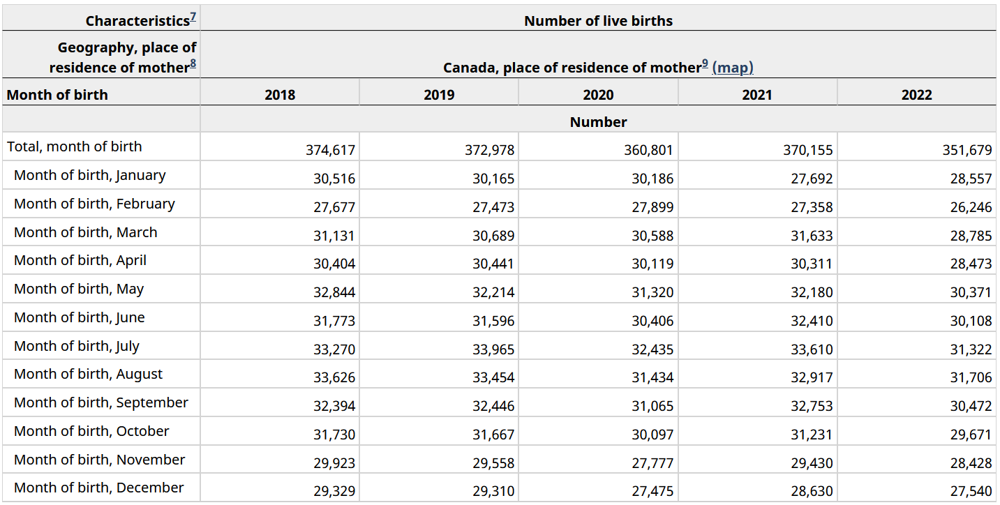

```{r setup, include=FALSE}
knitr::opts_chunk$set(echo = TRUE, warning = FALSE, message = FALSE, error = FALSE, dev = "ragg_png")
library(knitr)
options(scipen=999)
```

In the first chapter [Malcolm Gladwell's Outliers](https://www.amazon.com/Outliers-Story-Success-Malcolm-Gladwell/dp/0316017930) he discusses how in Canadian Junior Hockey there is a higher likelihood for players to be born in the first quarter of the year.  In his words:



Because these kids are older within their year they make all the important teams at a young age which gets them better resources for skill development and continues on and on.  

While it seems clear that more players are born in the first few months of the year what isn't explored is whether or not this would be expected.  Maybe more people in Canada **in general** are born earlier in the year.

Additionally I will explore whether this is still true in today's NHL.

To answer these questions I will download data on birth rates from Statistics Canada as well as player roster data from the NHL's API.

This analysis will leverage the `httr` package to download the data, `tidyverse` for data manipulation, and `ggtext`/`ggimage`/`scales` for visualization.

```{r}
library(tidyverse)
library(httr)
library(scales)
library(ggimage)
library(ggtext)
```

## Section 1: What is the distribution of births by month in Canada?

Gladwell's thesis is that you see more Canadian Junior hockey players born earlier in the year because of the way that cut-offs are set for Youth Hockey.  I think that he is correct but what if most people in Canada are born in the beginning of the year.  Then this might be representative of the population rather than an outlier effect.

Information about births by month in Canada can be found at [Statistics Canada](https://www150.statcan.gc.ca/t1/tbl1/en/tv.action?pid=1310041501).



Initially I had tried to web-scrape the table using `rvest` but could not figure out a way to deal with the "Number" row.  Since the data could be downloaded as a CSV file my alternative solution was to use `httr` to send a call to the download link to grab the file.  The URL was found by using the inspect option in Firefox when clicking the download link.

```{r cache=TRUE}
canada_raw <- GET('https://www150.statcan.gc.ca/t1/tbl1/en/dtl!downloadDbLoadingData-nonTraduit.action?pid=1310041501&latestN=0&startDate=19910101&endDate=20220101&csvLocale=en&selectedMembers=%5B%5B1%5D%2C%5B%5D%2C%5B1%5D%5D&checkedLevels=1D1%2C1D2') %>%
  content()
```

The `GET()` command sends the request to the server and the `content()` function returns the results.  Without the `content()` function there is a lot of additional information about the call such as headers, request url, etc. 

The raw data contains many columns that are either duplicative or unnecessary for this analysis:
```{r echo=FALSE}
canada_raw %>% head(2) %>% knitr::kable()
```

I pulled the data for 1991 through 2022 and each year has a total row as well as a row for each individual month.  To clean up this data I filter out the total rows with `str_detect()`, keep only the *REF_DATE* for the year, extract the month using `str_extract` and keep the *VALUE* which is the actual number of births.

```{r}
canada_births <- canada_raw %>%
  filter(!str_detect(`Month of birth`, 'Total')) %>%
  transmute(
    REF_DATE,
    MONTH = str_extract(`Month of birth`, 'Month of birth, (\\w+)', 1),
    VALUE
  ) %>% 
  group_by(MONTH) %>% 
  summarize(country_births = sum(VALUE)) %>% 
  mutate(country_pct = country_births/sum(country_births))
```

Then the distribution can be calculated by `dplyr` functions.  

```{r}
canada_births %>%
  transmute(
    `Canada %` = country_pct,
    `Expected % from Days in Month` = case_when(
      MONTH %in% c('April', 'June', 'September', 'November') ~ 30/365,
      MONTH == 'February' ~ 28/365,
      TRUE ~ 31/365,
    ),
    `Difference` = `Canada %` - `Expected % from Days in Month`,
    month_id = factor(MONTH, levels = c('January', 'February', 'March', 'April',
                                        'May', 'June', 'July', 'August',
                                        'September', 'October', 'November', 'December'))
  ) %>% 
  gather(lbl, value, -month_id) %>% 
  spread(month_id, value) %>%
  mutate(
    lbl = factor(lbl, levels = c('Canada %', 'Expected % from Days in Month', 'Difference')),
    across(January:December, ~percent(.x, accuracy = .1))) %>%
  arrange(lbl) %>% 
  kable()
  
```
  
At first glance, Canadians seem **less** likely to be born in the beginning of the year (particularly January and February) than from random distribution.  They're also less likely to be born in the end of the year.

Let's see what the Canadian NHL players look like:

## Section 2: What is the difstribution of births by month for Canadian NHL players?

To get the information about the NHL players I will use `httr` to query the NHLs API.  My original version of this analysis used the `nhlapi` package which is on CRAN.  But the NHL changed their API at some point in the last few months so that package no longer functioned.

Getting the 2023-2024 team rosters can be done through the API endpoint `https://api-web.nhle.com/v1/roster/{team}/20232024` where `{team}` is a three-character code representing each of the teams.  To get the rosters for each team I need to first get the codes for each team.

This is going to involve a bunch of JSON manipulation which is new to me so their is probably a more elegant solution.

All information on NHL teams can be retrieved from the `https://api.nhle.com/stats/rest/en/team` endpoint.  Using the same `GET()` / `content()` set from the prior section I can get all the team information

```{r}
teams <- GET('https://api.nhle.com/stats/rest/en/team') %>% 
  content()
```

This comes back as a list with two items, "data" which contains all the useful information and "total" which contains the number of elements returned in "data".  I just need the "data" piece.

```{r}
teams <- teams %>% 
  .[['data']] 
```

Now "teams" is a list with 59 elements with each element containing information (id, franchiseId, fullName, legaugeId, rawTricode, triCode) about a team.

```{r}
teams[1:3] %>% jsonlite::toJSON(auto_unbox = T) %>% jsonlite::prettify()
```

Ultimately I want to restructure this set of nested lists into a rectangular format.  The way I'll do this is create a tibble of list columns using `tibble()` and then `tidyr::unnest_wider` to turn each element of a list-column into its own column.

```{r}
teams <- teams %>% 
  tibble(data = .) %>% 
  unnest_wider(data)

```

Now everything is in a much more legible format:

```{r}
teams %>% 
  head(3) %>%
  kable()
```

That was all just to get the 3-character codes needed to actually get the rosters.  Since a separate call is made to the Rosters endpoint for each team this is a good opportunity to create a function.  Then I can use `purrr::map_dfr` to iterate through the team codes to combine all the rosters together.

For the function, it'll take a team code for input and extract the player's first name, last name, birth date, and birth country.

The data structure returned from the roster is a list with elements for forwards, defensemen, and goalies,  Then for each player within the data looks like:

```{r}
GET(glue::glue('https://api-web.nhle.com/v1/roster/NJD/20232024')) %>% 
    content() %>%
    .[['forwards']] %>%
    .[[1]] %>%
    jsonlite::toJSON(auto_unbox = T, pretty = T) %>% 
    jsonlite::prettify()
```
To get this data, I'll (1) pass a team code into the function to call to the API with `GET()` and `content()`, (2) use `flatten()` to remove the level of forwards, defensemen, and goalies to have all the players as one nested list, (3) turn the data into a tibble of list-columns, and (4) use the `tidyr::hoist()` function to pull only the items I want from the structure.

```{r}
get_roster <- function(team){
  GET(glue::glue('https://api-web.nhle.com/v1/roster/{team}/20232024')) %>% 
  content() %>%
  flatten() %>%
  tibble(data = .) %>%
  hoist('data',
    'firstName' = list('firstName', 1L),
    'lastName' = list('lastName', 1L),
    'birthDate',
    'birthCountry'
  ) %>% 
  transmute(team = team, firstName, lastName, birthDate, birthCountry)
}
```

Within `hoist()`, the construction of `list('firstName', 1L)` is to avoid having to pull the "default" item within firstName.  I'm simply saying to grab the value of the first element within the firstName item.  Since birthDate and birthCountry are not nested there is no need to do that for those fields.

Finally to get all the players from all the teams I use `purrr::map_dfr()` to iterate through the team codes and run my function.  For some reason there are empty rows that get returned.  I'll just exclude them rather than try to actually debug.

```{r cache = TRUE}
all_roster <- map_dfr(teams$triCode, get_roster) %>%
  filter(!is.na(firstName))
```

Now we have a dataset of the `r nrow(all_roster)` players in the NHL.

But I only want to look at Canadian players because I have no idea if the same cut-offs that apply in Canada apply in other countries in the world.  I'll also do some data cleanup on birth months and calculate the player distribution.

```{r}
canada_players <- all_roster %>% 
  filter(birthCountry == 'CAN') %>% 
  mutate(
    mob = month(ymd(birthDate), label = T, abbr = F),
    mob_id = month(ymd(birthDate))
  ) %>% 
  count(mob_id, mob, name = "players") %>%
  mutate(player_pct = players/sum(players))
```

Now we have the distribution of birth months for Canadian NHL players

## Section 3: Putting it all together

The last section is to combine the Canada birth month data from Section 1 with the Canadian NHL player from Section 2 and make a pretty visualization.

First I combining the data and create a field for the percentage of births you'd expect if every day was equally likely (ex. if January has 31 days then there is a 31/365 chance of being randomly born in January):

```{r}
combined <- canada_players %>%
  left_join(canada_births, by = c('mob' = 'MONTH')) %>%
  #Put in random value
  mutate(
    random = case_when(
      mob_id %in% c(4, 6, 9, 11) ~ 30/365,
      mob_id %in% c(1, 3, 5, 7, 8, 10, 12) ~ 31/365,
      mob_id == 2 ~ 28/365
    )
  )
```

For the visualization I'm going to use the `ggimage` package to use icons of the Canadian flag and the NHL logo.  This package can render a URL so I'll create variables for those URLs.

```{r}
NHL_ICON <- "https://pbs.twimg.com/media/F9sTTAYakAAkRv6.png"
CANADA_ICON <- "https://cdn-icons-png.flaticon.com/512/5372/5372678.png"
```

Finally, a combination of `ggplot`, `ggtext`, and `ggimage` is used to create the visualization.

```{r fig.height=8, fig.width=10}
ggplot(combined, aes(x = fct_reorder(mob, -mob_id))) + 
  geom_line(aes(y = random, group = 1), lty = 2, color = 'grey60') + 
  geom_linerange(aes(ymin = country_pct, ymax = player_pct)) + 
  geom_image(aes(image = NHL_ICON, y = player_pct), size = .08) + 
  geom_image(aes(image = CANADA_ICON, y = country_pct), size = .07) + 
  geom_text(aes(label = percent(player_pct, accuracy = .1), 
                y = if_else(player_pct > country_pct, player_pct + .003, player_pct - .003))) + 
  geom_text(aes(label = percent(country_pct, accuracy = .1), 
                y = if_else(country_pct > player_pct, country_pct + .003, country_pct - .003))) +
  annotate(
    'curve',
    xend = 2.3,
    x = 1.5,
    yend = .084,
    y = .10,
    curvature = .25,
    arrow = arrow(
      length = unit(7, "pt"),
      type = "closed"
    )) + 
  annotate(
    'richtext',
    x = 1,
    y = .105,
    label = "The grey line is the expected % of births<br />if birth month was completely random",
    size = 4
  ) + 
  scale_y_continuous(labels = percent) + 
  coord_flip() + 
  labs(x = "Month of Birth", y = "Percentage of Births (%)",
       title = "Are Canadian NHL Player More Likely to be Born Early in the Year?",
       subtitle = 'Comparing the distribution of birth months between Canadian NHL players and Canada in general ',
       caption = glue::glue(" - Canadian NHL Players Birth Month Distribution <br />
                             - Canadian Birth Month (1991-2022) Distribution")
       ) + 
  theme_light() +
  theme(
    text = element_text(family = 'Asap SemiCondensed', size = 14),
    plot.title.position = 'plot',
    plot.title = element_markdown(),
    plot.caption = element_markdown()
  )
```

Finally for a more stats-y perspective.  A chi-sq test can be used to see if the distribution of the Canadian NHL players is different than Canada in general.  In the following code, *x* is the number of Canadian NHL players born in each month and *p* is the expected proportion based on the distribution of birth months for Canada as a whole.

```{r}
broom::tidy(chisq.test(x = combined$players, p = combined$country_pct))
```
The p-value of <.01 means that we can reject the null hypothesis that they are the same distribution. From the visualization we can see that there are much more NHL players in January and February than you'd expect based on Canada's population and far fewer NHL born in August through December.

So it seems that Malcolm Gladwell's thesis in Outliers still holds true in today's NHL among Canadian players.
